# Aceleração Global Dev Everis #4 :rocket:

Anotações das aulas. :pencil2::books:

- [x] [Abertura - Como trabalhar em um ambiente ágil e global](#abertura---como-trabalhar-em-um-ambiente-ágil-e-global)
- [x] [Linux: A introdução ao sistema operacional](#linux---a-introdução-ao-sistema-operacional)
- [x] [Shell script - Manipulando Arquivos](#shell-script---manipulando-arquivos)
- [x] [Monitoramento de clusters Hadoop de alto nível com HDFS e Yarn](#monitoramento-de-clusters-hadoop-de-alto-nível-com-hdfs-e-yarn)
- [x] [Orquestrando ambientes de big data distribuídos com Zookeeper, Yarn e Sqoop](#orquestrando-ambientes-de-big-data-distribuídos-com-zookeeper-yarn-e-sqoop)
- [x] [Como realizar consultas de maneira simples no ambiente complexo de Big Data com HIVE e Impala](#como-realizar-consultas-de-maneira-simples-no-ambiente-complexo-de-bigdata-com-hive-e-impala)
- [x] [Explorando o poder do NoSQL com Cassandra e Hbase](#explorando-o-poder-do-nosql-com-cassandra-e-hbase)
- [x] [Intensivo de Python - O mínimo que você precisa saber](#intensivo-de-python---o-mínimo-que-você-precisa-saber)
- [x] [Trabalhando com serviços de mensageria real time com Python e Kafka na prática](#trabalhando-com-serviços-de-mensageria-real-time-com-python-e-kafka-na-prática)
- [x] [Processando grandes conjuntos de dados de forma paralela e distribuída com Spark](#processando-grandes-conjuntos-de-dados-de-forma-paralela-e-distribuída-com-spark)
- [ ] [Criando pipelines de dados eficientes - Parte 1](#criando-pipelines-de-dados-eficientes---parte-1)
- [ ] [Criando pipelines de dados eficientes - Parte 2](#criando-pipelines-de-dados-eficientes---parte-2)
- [ ] [Orquestrando Big Data em Ambiente de Nuvem](#orquestrando-bigdata-em-ambiente-de-nuvem)
- [ ] [Scala: o poder de uma linguagem multiparadigma](#scala-o-poder-de-uma-linguagem-multiparadigma)
- [x] [O que você precisa saber para construir APIs verdadeiramente restfull](#o-que-você-precisa-saber-para-construir-apis-verdadeiramente-restfull)
- [x] [Graduação - habilidades que diferenciam um sênior na everis](#graduação---habilidades-que-diferenciam-um-sênior-na-everis)


<br><br><br>

------

## Abertura - Como trabalhar em um ambiente ágil e global

*Experts com grande experiência em projetos de missão crítica compartilham os princípios e competências essenciais para o dev desenvolver habilidades globais.*

:calendar: 18/01/2021		:timer_clock: 20:00h		:hourglass: 2 horas	[:arrow_up:](#aceleração-global-dev-everis-4-rocket)

<br>

*Notas da live*

#### Qualidades de um bom desenvolvedor (Soft Skills)

https://imasters.com.br/desenvolvimento/as-5-qualidades-de-um-bom-desenvolvedor


#### Metodologia Ágil

https://neilpatel.com/br/blog/metodologia-agil/

https://robsoncamargo.com.br/blog/o-que-e-metodologia-agil


<br><br><br>

------

## Linux - A introdução ao sistema operacional

​	:hourglass: 10 horas	[:arrow_up:](#aceleração-global-dev-everis-4-rocket)

<br>

#### Introdução ao Linux e configuração inicial

- **História do Linux**

Criado 1991 por Linus Torvalds. O Linux é o Kernel ou Núcleo do Sistema Operacional. Ele é um sistema Multitarefa e Multiusuário.

O Linux pode ser *distribuído* por empresas, organizações ou mesmo pessoas, que podem colocar características no SO.

O Ubuntu é um SO de código aberto que é desenvolvido pela Canonical com base no kernel Linux.

- **Instalação e configuração**

VMWare 15

Ubuntu 20.04

- **Apresentação do Sistema Operacional**
  - Ambiente
  - LibreOffice/Navegadores
  - Software Updater
- **Configuração do Sistema Operacional - Parte 1**

Em Settings... Notifications... Search...  Privacy

Diagnostics - Enviar relatório de erros.

Atalhos do Ubuntu - Settings/Keyboard Shortcuts

- **Configuração do Sistema Operacional - Parte 2**

Configurando para portugues em Settings

Acesso Universal

Aplicativos Padrão

- **Certifique seu Conhecimento**

  Marque a alternativa com 3 principais distribuições Linux: 	*Ubuntu, Debian e Suse.*

  O que é o Linux?	*O Linux é o Kernel do Sistema Operacional.*	

  O que é o Ubuntu Linux?	*É uma distribuição baseada no Kernel Linux, tendo sua base no Debian e amplamente aceita em todas as comunidades de usuários.*

  Quem criou o Linux? 	*Linus Torvalds.*

  O que é uma "distro"? 	*Uma distro é uma distribuição baseada no Kernel Linux.*

  O que é um software de virtualização de Sistemas Operacionais? 	*É um software que permite criar máquinas virtuais com um ou mais sistemas dentro de um único ambiente.*

  Qual a empresa criadora e mantenedora do Ubuntu? 	*Canonical.*

  Marque abaixo a alternativa correta contendo 3 programas pré instalados no Ubuntu 20.04: 	*Mozilla Firefox, Rhythmbox e Thunderbird.*	

  O que é a Doca? *A Doca e a barra de tarefas do Ubuntu Linux.*	

  Em qual sistema o criador do Linux se baseou para sua criação?	*Unix.*

#### Conhecendo o terminal Linux e seus atalhos

- **Conhecendo o terminal e primeiros comandos**

Terminal, Shell ou konsole é uma linha de comando onde podemos executar programas específicos do Linux. CTRL + ALT +T no Ubuntu

man sudo_root

pwd *Diretório local*

- **Atalhos**

Ctrl+C Cancela o comando atual

Ctrl+U Apaga a linha inteira

- **Revisão do Conteúdo**

cd~ *Muda para diretório pessoal*

history *Histórico de comandos*

ls -l *Opção lista longa com detalhes*

<u>*Exercícios Práticos*</u>

1) Abra o Terminal
2) Crie uma Pasta de nome Ubuntu dentro da Pasta Documentos
3) Mova esta Pasta para o diretório Pessoal
4) Crie um arquivo vazio de nome teste.txt dentro da Pasta Ubuntu
5) Renomeie este Arquivo como linux.txt
6) Crie uma cópia deste arquivo na Pasta Downloads
7) Exiba todos os comandos digitados no Terminal
8) Execute a ajuda do comando ls
9) Execute o manual do comando mv
10) Pare a execução do manual
11) Saia do Terminal utilizando sequência de teclas
12) Exclua a pasta Ubuntu
13) Exclua o arquivo linux.txt 
14) Limpe o terminal
15) Utilize o comando para sair do terminal

- **Certifique seu conhecimento**

  Qual o comando lista arquivos e diretórios no Linux? 	*ls*

  O que é o terminal no Linux?	*O terminal, Shell ou Konsole, é uma ferramenta de linha de comando do Linux.*

  Qual comando cria diretórios no Linux?	*mkdir*

  Qual das alternativa abaixo move um diretório de nome Ubuntu para a pasta pessoal?	*mv Ubuntu ~*

  Qual comando remove um arquivo do Linux?	*rm*

  Qual comando abaixo repete o ultimo comando digitado no terminal?	*!!*

  Qual comando utilizado para copiar um arquivo?	*cp*

  Qual a sequência de teclas correta para acessar o terminal no Linux?	*CTRL + ALT + T*

  Qual o comando usado para mover ou renomear arquivos ou diretórios?	*mv*

  Qual combinação de teclas de atalho finaliza o terminal?	*CTRL + D*

#### Comandos para manipulação de arquivos e textos e redirecionamento

- **Lidando com arquivos .txt**

nano teste.txt

​		ctrl + g *Exibe as informações e comandos do nano*

​		ctrl + j *Justifica o texto*

​		alt + u *desfazer última ação*

​		ctrl + o *salva o arquivo*

​		ctrl + x *fechar arquivo*

<u>cat</u> exibe conteúdo do arquivo e <u>tac</u> exibe o conteúdo inverso de um arquivo

- **Propriedades do arquivo .txt e comandos de datas**

head teste.txt *Exibe as primeiras 10 linhas*

tail teste.txt *Exibe as 10 ultimas linhas*

tail teste.txt > distros.txt *Cria um arquivo com a saída do comando tail, ou head*

cal *Calendário do mês corrente*

cal > calendario.txt *Cria um arquivo com a saída do comando cal*

date *Exibe a data e hora que executou comando*

date >> calendario.txt *Adiciona a saída do comando date no final do arquivo calendario.txt*

cal 2020 *Exibe o calendario do ano 2020*

tail distros.txt | grep Linux *O grep vai fazer uma busca dentro do arquivo distros.txt*

- **Comando de paginação de textos e criação de pastas**

cat teste.txt | more *Exibe o arquivo teste.txt com paginação --Mais--*

cat teste.txt | less *Exibe o arquivo teste.txt com paginação :*

ctrl + z *Sai do arquivo*

& *e* && *Operadores de redirecionamento*

cat maio.txt & cat julho.txt *Exibe os arquivos separados por comando no terminal com pausa*

cat maio.txt && cat julho.txt *Exibe os arquivos consecutivos*

file maio.txt *Exibe informações do arquivo ou diretório* 

file linux_ubuntu

whatis *Exibe o que faz determinado arquivo*

- **Revisão do conteúdo**

  (|) Envia a saída de um comando para entrada de outro comando permitindo a execução de dois comandos.

  (>) Redireciona a saída de um comando para outro comando ou arquivo

  (>>) Redireciona a saída e adiciona a mesma para um comando ou arquivo

  (<) Direciona a entrada de um arquivo para a saída de um comando

  (&) Este operador permite usar dois comando e separa suas saídas no terminal

  (&&) Usado para que dois comandos só sejam executados se o primeiro for executado com sucesso

rm -r * *Remover todos os arquivos de uma pasta*

Apostilas e informações do Linux https://guiafoca.org

- **Exercícios de Revisão**

Exercícios de Revisão
1) Crie uma pasta de nome Exercícios e Acesse a mesma
2) Crie um arquivo vazio de nome lista_nomes.txt
3) Abra este arquivo com o Editor Nano
4) Digite 20 Nomes de Pessoas Conhecidas incluindo o seu, pulando de linha para cada nome inserido.
5) Salve o arquivo
6) Exiba os 10 primeiros Nomes da Lista
7) Exiba os 10 ultimos Nomes da Lista
8) Procure no texto o seu nome
9) Crie um Arquivo chamado setembro.txt com a saida do comando cal.
10) Adicione o conteúdo do arquivo setembro.txt ao arquivo lista_nomes.txt
11) Exiba o arquivo lista_nomes.txt com paginação
12) Exiba o caminho do arquivos setembro.txt
13) Exiba o tipo do arquivo lista_nomes.txt
14) Exiba a explicação do comando ls
15) Renomeie o Arquivo lista_nomes.txt para arquivo.txt
16) Limpe o Terminal
17) Saia do Terminal

- **Certifique seu Conhecimento**

  Hugo deseja criar uma pasta com seu nome e logo em seguida, se houver sucesso na criação da pasta, abrir esta pasta no terminal. Qual sequência de comandos Hugo deve usar?	*mkdir Hugo && cd Hugo*

  José quer exibir o calendário do mês de junho de 2019 na saída do terminal, qual sequência de comandos ele deve digitar?		*cal junho 2019*

  Qual das opções abaixo utilizamos quando queremos redirecionar a saída de um comando para outro comando ou arquivo?		*Nenhuma das alternativas.*

  Qual comando utilizamos para criar um arquivo vazio de nome teste.txt?	*touch teste.txt*

  José quer saber a explicação do comando ls, qual sequência de comandos ele deve usar?	*whatis ls*

  Qual comando para editarmos o arquivo teste.txt no editor nano?	*nano teste.txt*

  João deseja procurar seu nome em um arquivo chamado lista_nomes.txt, qual sequência de comandos ele deve usar?	*grep Joao lista_nomes.txt*

  Qual comando utilizado para exibir o conteúdo de um arquivo no terminal?	*cat*

  Qual comando utilizado para exibir a data atual do sistema?	*date*

  Qual comando utilizado para inverter a saída do conteúdo de um arquivo no terminal?	*tac*

#### Diretórios do Linux e Comandos de Sistema

- **Apresentação dos comandos de diretórios do Linux**

/bin/ *Binários principais dos usuarios. Executáveis*

/boot/ *Arquivos do sistema de Boot*

/dev/ *Arquivos de dispositivos*

/etc/ *Arquivos de configuração do sistema*

/home/ *Diretório dos usuários comuns do sistema*

/lib/ *Bibliotecas essenciais do sistema e os modulos do kernel*

/media/ *Diretório de montagem e dispositivos*

/mnt/ *Diretório de montagem de dispositivos - mesmo que media*

/opt/ *Instalação de programa não oficiais da distribuição ou por conta do usuário*

/sbin/ *Armazena arquivos executáveis que representam comandos administrativos. Exemplo: shutdown*

/srv/ *Diretórios para dados de serviços fornecidos pelo sistema*

/tmp/ *Diretório para arquivos temporários*

/usr/ *Segunda hierarquia do sistema, onde ficam os usuarios comuns do sistema e programas*

/var/ *Diretório com aquivos variaveis gerados pelos programas do sistema. Exemplo: email, cache, impressoras*

/root/ *Diretório do usuario root - O usuário root tem o total poder sobre o sistema.* 

/proc/ *Diretório virtual controlado pelo Kernel*

- **Praticando no terminal os comandos de diretórios e sistema - Parte 1**

cat /proc *Informações de cpu*

cat /proc/cpuinfo | more *Informações de cpu*

cat /proc/meminfo

lspci *Todos os hardwares conectados via pci*

lsusb | more *Informações usb*

arch *Arquitetura do sistema*

uname *Nome do kernel*

uname -r *Versão do kernel*

uname -m *Arquitetura do kernel*

free *Saída de memória fisica e memoria swap*

du -h ~ | more *Relação de arquivos e diretórios e alocação de espaço no hd*

-h *human readble - leitura facilitada com espaços*

- **Praticando no terminal os comandos de diretórios e sistema - Parte 2**

cat /etc/passwd | more *Todos os usuários do sistema*

reboot *Reinicia o sistema*

shutdown -h now *Desliga o sistema*

shutdown --help *Informações do comando shutdown*

​		-r *Reinicia o sistema*

​		-h *Desliga o sistema*

​		-c *Cancela*

lscpu | more *Informações sobre processamento*

lshw | more *Lista de todos os hardwares*

lshw -short *Exibe de forma simplificada os hardwares*

- **Revisão do conteúdo**

echo "texto para o terminal"

echo -e "\n" *quebra de linha. Preciso colocar -e*

- **Certifique seu conhecimento**

  Quais comandos exibem a arquitetura do kernel Linux?		*uname -m, arch*

  Qual comando exibe a versão do kernel Linux?		*uname -r*

  Um técnico deseja exibir todos os dispositivos do tipo USB conectados ao Linux, qual comando ele deve utilizar?			*lsusb*

  Qual a saída do comando cat /proc/cpuinfo?		*Informações de Processamentos.*

  João deseja visualizar o espaço ocupado por cada arquivo e pasta dentro de /home no hd. Qual sequência de comandos ele deve usar?		*du -h /home*

  Qual o comando exibe todas as placas PCI listadas pelo Linux?		*lspci*

  Qual comando exibe o nome do kernel?		*uname*

  Qual o comando exibe informações de memória física e swap?		*free*

  Qual comando exibe todos os hardwares listados pelo Linux?		*lshw*

  Qual a saída do comando cat /proc/meminfo?		*Informações de Memória.*

#### Fundamentos de Rede e Comandos de Rede

- **O que são Redes, Protocolos e Interfaces de rede**

Rede: É um conjunto de equipamentos interligados de maneira a trocarem informações.

Rede Wan: Wide Area Network ou World Area Network é uma rede geograficamente distribuída.

Rede Man: Metropolitan Area Network é uma rede metropolitana que interligam várias redes locais.

Rede Lan: Local Area Network é uma rede local de uma forma geral em um único prédio ou campus.

Protocolos: É a linguagem usada pelos dispositivos de uma rede de modo que eles consigam se entender. Existem vários protocolos.

​		IP - Protocolo de Internet - Endereço Ip - números que identificam seu computador em uma rede.

​		ICMP - (Internet Control Message Protocol) tem por objetivo prover mensagens de controle na comunicação entre nós.

​		DNS - Domain Name Server - esse protocolo de aplicação tem por função identificar endereços Ips e manter uma tabela com os endereços dos caminhso de algumas redes.

Interface de Rede: é um software e/ou hardware que faz a comunicação em uma rede de computadores. (No Ubuntu está na pasta /dev). Ex: eth0 - Placa de rede Ethernet - cabeada

A interface loopback é um tipo especial de interface que permite fazer conexões com você mesmo, com ela, você pode testar vários programas de rede sem interferis em sua rede. Por padrão, o endereço IP 127.0.0.1 foi escolhido para loopback.

- **Comando ifconfig**

sudo apt install net-tools

ifconfig *Exibe Interfaces de rede*

ipv4 inet 192.168.110.128

netmask *Mascara de rede - separa rede publica da rede privada*

broadcast *Endereço público da minha máquina*

ipv6 inet6 *Sequência hexadecimal*

ether *Enderço físico, da placa de rede. Conhecido como endereço maq. Ele é único da placa de rede*

- **Comandos hostname e ping**

hostname *Exibe informações sobre o host, nosso computador na rede*

hostname -I *Endereço IP*

hostname -i *Com i minuscula, info de loopback*

who *Exibe como estamos logados na rede*

whoami *Usuario logado na rede*

ping *Faz parte do protocolo icmp, faz controle de host, verifica se está ativo ou inativo*

ping www.google.com.br -w  4 *Envia 4 pacotes de ping*

dig www.google.com.br *Informações sobre os caminhos de rede de um ip ou host*

- **Comandos traceroute e finger**

sudo apt install traceroute

traceroute to  www.google.com *Exibe os nós até chegar no google.com*

dig www.google.com +short *Exibe apenas o endereço dns, ip*

whois www.google.com *informações sobre determinado host, dono do dominio, país, servidor dns*

finger *Informações de usuario logado no nosso host*

- **Revisão do conteúdo e exercícios - Parte 1**

- **Revisão do conteúdo e exercícios - Parte 2**

- **Exercícios Práticos**

Exercícios Práticos
1) Crie um arquivo de aularedes.txt
2) Exiba o número de IP da rede no terminal
3) Adicione a saída do comando anterior ao arquivo aula redes.txt
4) Exiba o número de IP Loopback no terminal
5) Adicione a saída do comando anterior ao arquivo aula redes.txt
6) Exiba Informações DNS sobre o host www.pudim.com.br
7) Adicione a saída do comando anterior ao arquivo aula redes.txt
8) Exiba Informações do Usuário logado na rede
9) Adicione a saída do comando anterior ao arquivo aula redes.txt
10) Execute um teste no host www.pudim.com.br com 6 pacotes
11) Adicione a saída do comando anterior ao arquivo aula redes.txt
12) Trace a Rota do seu computador até o host www.pudim.com.br
13) Adicione a saída do comando anterior ao arquivo aula redes.txt
14) Exiba Informações sobre Interfaces de Rede e Endereços IP no terminal
15) Adicione a saída do comando anterior ao arquivo aula redes.txt
16) Limpe o terminal
17) Imprima o arquivo aularedes.txt com paginação no terminal

- **Certifique seu conhecimento**

  Qual comando testa se um host está ativo ou inativo enviando pacotes de requisição do protocolo ICMP?	*ping*

  Qual comando testa se um host está ativo ou inativo enviando pacotes de requisição do protocolo ICMP?		*Interface de rede é um software e/ou hardware que faz a comunicação em uma rede de computadores.*

  Qual comando exibe o nome do computador na rede (nome do host)?		*hostname*

  O que é Protocolo em Redes de Computadores?		*A “linguagem” usada pelos dispositivos de uma rede de modo que eles consigam se entender.*

  Qual das alternativas abaixo representa 3 protocolos de Rede?	*IP, ICMP e DNS*

  Qual sequência de comandos exibe a rota do seu computador (sua rede) até o host www.google.com?	*traceroute www.google.com*

  Qual das alternativas abaixo representa as 3 estruturas de rede conhecidas?	*WAN, MAN e LAN*

  Qual comando exibe Interfaces de Rede e Endereços IP no terminal?	*ifconfig*

  Qual sequência de comandos exibe o número de IP do site www.pudim.com.br?	*dig www.pudim.com.br +short*

  O que é Rede?	*É um conjunto de equipamentos interligados de maneira a trocarem informações e compartilharem recursos.*

#### Fuçando no Linux com comandos diversos

- **Comandos history, alias e outras interações com arquivos .txt**

history *Exibe histórico de comandos. Coloque a flag -c para apagar*

alias hh='history' *Cria um atalho para comandos. Nesse caso, só digita hh para exibir o histórico*

nl arquivo.txt *Número de linhas do arquivo*

wc -l arquivo.txt *Exibe todas as linhas, inclusive em branco. A flag -w exibe o total de palavras. -c para total de bytes. -m total de caracteres. --help para todas as informações*

ls -a *Exibe arquivos ocultos*

ls -F *Coloca uma barra em cada diretório*

cmp arquivo1.txt arquivo2.txt *Faz comparação entre arquivos*

diff *Exibe outra diferença de arquivos*

sort -n arquivo.txt *Organiza a saída do arquivo em ordem numérica*

- **Comandos last reboot, route, time, cowsay e cmatrix**

last reboot *Todas as Informações de reinicialização do sistema*

route -n *Tabelas de roteamento ip do nosso kernel*

time *Mostra o tempo de um processo*

uptime *Tempo que o sistema está rodando*

Comandos que precisam de instalação

​	cowsay *Mostra um desenho. Com a flag -d ; -g*

​	cowsay -f (vader)(tux)(dragon) *Exibe vários animais*

​	xcowsay

​	cmatrix

- **Comandos para desligar o sistema operacional**

init 0 *Desliga a máquina*

telinit 0 *Desliga a máquina*

halt *Pede uma autenticação para desligar a máquina*

seq 1 10 > arquivo.txt *Imprime uma sequência de números e coloca dentro de um arquivo.*

whereis *Exibe o caminho do programa e seu manual*

which *Exibe o caminho de um programa*

cmp *Compara dois aquivos*

- **Revisão do conteúdo com JSLinux**

Funciona parte de console e gráfica no browser. https://bellard.org/jslinux

- **Certifique seu conhecimento**

  José deseja exibir a comparação entre dois arquivos de texto, um arquivo de nome vazio.txt  e outro arquivo.txt qual sequência ele deve digitar no terminal?	cmp vazio.txt arquivo.txt

  José deseja exibir a contagem do número de palavras de um arquivo de nome vazio.txt qual sequência ele deve digitar no terminal?	wc -w vazio.txt

  Qual comando organiza um arquivo de texto em ordem alfabética ou numérica?	sort

  Qual dos comandos abaixo coloca números de linhas em um arquivo de texto?	nl

  José deseja exibir a contagem do número de linhas de um arquivo de nome vazio.txt qual sequência ele deve digitar no terminal?	wc -l vazio.txt

  Quais opções de comandos temos para desligar a máquina rapidamente?	shutdown -h now, init 0, telinit 0, e halt

  José deseja exibir a contagem do número de bytes de um arquivo de nome vazio.txt qual sequência ele deve digitar no terminal?	wc -c vazio.txt

  Qual sequência de comandos exibe o tempo de processamento do comando traceroute no host www.pudim.com.br?	time traceroute www.pudim.com.br

  Qual das opções do comando history apaga o histórico de comandos?	history -c

  João deseja instalar o programa cowsay para sua filha, qual sequência de comandos ele deve digitar no terminal?	sudo apt install cowsay

#### Controle de usuários, grupos e permissões

- **Como adicionar usuários**

adduser nomedousuario

- **Como trocar de usuário e alterar sua senha**

su nomedousuario *Trocar de usuario*

passwd nomedousuario *Alterar senha*

Método Zenit Polar

- **Como exibir informações de login e remover um usuário**

laslog *Exibir informações de Login dos Usuarios*

last *Exibir uma listagem do usuario de entrada e saída do sistema*

logname *Exibe o nome do usuario atual logado no sistema*

id *Exibe todos os identificadores do usuário*

*Exibir todos os usuarios* cat /etc/passwd

userdel -r nomedousuario *Remove o usuario, com a flag -r vai remover a pasta pessoal*

- **Como criar um grupo e gerenciar os usuários**

cat /etc/group *Exibe todos os grupos do sistema*

groups *Exibe todos os grupos de um usuário*

addgroup *Criar um grupo*

adduser usuario grupo *Adiciona um usuario a um grupo*

gpasswd -a usuario grupo *Adiciona um usuario a um grupo*

gpasswd -d *Remove um usuario de um grupo*

groupdel grupo *Remover um grupo*

- **Como gerenciar permissões em diretórios e o que é o modo octal**

Permissões

​		r - read

​		w - write

​		x - eXecution

ls -lh *Verifica permissões em um diretório*

**d** *é pra diretório e* **-** *é pra arquivos*

drwx**r-x**r-x 		dono**grupo**outros

chmod *Mudar a permissão de um arquivo ou diretório*

| User (owner) |    Group    |    Other    |
| :----------: | :---------: | :---------: |
| r \| w \| x  | r \| w \| x | r \| w \| x |
| 4 \| 2 \| 1  | 4 \| 2 \| 1 | 4 \| 2 \| 1 |

Composto por números sob a base 8, ou seja, de 0 a 7

O primeiro dígito representa o dono do ficheiro/diretório (u)

O segundo dígito representa o grupo (g)

O terceiro dígito representa os outros (o)

As permissões são específicas para cada grupo.

​		Exemplo: 0 quando não tem nenhuma atribuição 1 0 0

chmod 100 arquivo.txt

ls -lh *Exibe informações*

- **Comando chmod**

4+2+1 = 7

Para usuario: chmod 700 arquivo.txt

todas as condições 7

somente leitura e execução 5

Mais alto nível de privilégio 777

- **Revisão e prática do conteúdo**

- **Certifique seu conhecimento**

  Qual sequência de comandos abaixo adiciona um usuário de nome teste a um grupo de nome grpteste?	 adduser teste grpteste

  Qual comando deleta usuários e suas respectivas pastas pessoais?	userdel -r

  Andrea deseja exibir todos os usuários de um sistema, qual sequência de comandos ela deve utilizar?	cat /etc/passwd

  Qual comando exibe o nome do usuário logado no sistema?	logname

  Qual comando adiciona um grupo?	addgroup

  Qual sequência de comandos abaixo remove um usuário de nome teste do grupo de nome grpteste?	gpasswd –d teste grpteste

  Qual comando exibe os identificadores de um usuário?	id

  Qual comando é usado para alterar a senha de um usuário?	passwd

  Augusto tem um dois usuários em seu sistema: um de nome augusto e outro guto. Sendo que no terminal de Augusto está logado no usuário augusto, que sequência de comandos ele deve utilizar para trocara para o usuário guto?	su guto

  Qual comando é usado para adicionar usuários?	adduser

#### Compactação, descompactação e arquivamento

- **Comandos gzip, zip e bzip2**

Compactadores são programas que diminuem o tamanho de um arquivo ou diretório

gzip *Compactador muito usado, possui uma taxa excelente de compactação*

gzip arquivo.txt

Descompactar gunzip arquivo.txt.gz

gzip -9 arquivo.txt *Compactação máxima*

Compactador zip

​		zip arquivo.zip arquivo.txt

​		unzip arquivo.zip

Compactador bzip2

​		bzip2 arquivo.txt

​		bzip2 -d arquivo.bz2

- **Comandos rar e tar**

Compactador rar

​		rar a arquivo.rar arquivo.txt

​		rar x arquivo.rar

Arquivador: junta vários arquivos em um só.

Arquivador tar

​		tar -cf aularedes.txt.tar aularedes.txt		*Vai criar um arquivo tar.gz*

​		tar -xvf aularedes.txt.tar.gz

​		tar -xvf aularedes.txt.tar.gz -C ~/Documentos *Vai extrair dentro do diretório*

​		gunzip arquivos.tar.gz 	*Vai retirar a compactação*

- **Revisão e prática do conteudo**

- **Certifique seu Conhecimento**

  Qual opção do arquivador tar descompacta um arquivo compactado e arquivado com tar?	*-xvf*

  Qual comando abaixo compacta arquivos e adiciona a extensão zip?	*zip*

  Qual comando abaixo compacta arquivos e adiciona a extensão bz2?	*bzip2*

  Qual a extensão gerada pelo comando de compactação de arquivos bzip2?	*bz2*

  Qual opção do compactador bzip2 descompacta um arquivo bz2?	*-d*

  Qual comando abaixo compacta arquivos e adiciona a extensão gz?	*gzip*

  Qual comando abaixo representa um arquivador?	*tar*

  Qual comando abaixo não compacta arquivos?	*bz2*

  Qual comando abaixo compacta arquivos e adiciona a extensão rar?	*rar*

  Qual opção do compactador rar descompacta um arquivo rar?	*-x*

#### Gerenciamento de pacotes

- **Instalação, atualização e remoção de pacotes**

Existem pacotes com a extensão .deb, .rpm e outros.

gerenciadores de pacotes são sistemas que possuem resolução automática de dependencias entre pacotes. Ex: dpgk, apt e yum

apt

​		sudo apt install pacote *Instala pacote*

​		sudo apt upgrade pacote *Atualiza pacote*

​		sudo apt remove pactote *Remove um pacote*

- **Atualização de sistema e o comando dpkg**

sudo apt update && apt upgrade

sudo su *Usuario root*

Sites: https://pkgs.org e https://rpm.pbone.net

Gerenciador dpkg

​		sudo dpkg -i pacote.deb

​		copia arquivo Binary Package do site

​		sudo dpkg -I pacote.deb *Descrição do pacote*

​		sudo dpkg -r nomedopacote *O nome do pacote é dado na descrição do pacote. Em Package*

- **Introdução ao Fedora**

https://gtfedora.org/pt_BR

- **Comandos rpm e yum**

Gerenciador rpm

​		rpm -ivh pacote.rpm

​		rpm -ivh --nodeps pacote.rpm

​		rpm -U pacote.rpm *Atualização do pacote*

​		rpm -e pacote.rpm *Remoção do pacote*

Gerenciador yum

​		yum install pacote		*Instalação do pacote*

​		yum update pacote 	*Atualização do pacote*

​		yum remove pacote	*Remoção do pacote*

- **Revisão e prática do conteúdo**

- **Certifique seu Conhecimento**

  O que é um pacote?	*Pacotes são programas colocados dentro de um arquivo identificados por sua extensão.*

  Qual distribuição utilizamos neste curso para trabalhar com pacotes rpm?	*Fedora*.

  Qual gerenciador instala, e remove pacotes .deb?	*dpkg*

  Qual opção do comando rpm instala um pacote rpm?	*-ivh*

  Qual sequencia de comandos remove um programa instalado pelo apt?	*sudo apt remove*

  Qual opção do comando yum remove um pacote rpm?	*remove*

  Qual gerenciador que além de instalar pacotes também atualiza o sistema?	*apt*

  Qual distribuição utilizamos neste curso para trabalhar com pacotes deb?	*Ubuntu*.

  Quais gerenciadores instalam e removem pacotes rpm?	*rpm e yum*

  José deseja instalar o pacote wireshark no ubuntu utilizando o apt. Qual sequência de comandos José deve usar?	*sudo apt install wireshark*

<br><br><br>

------

## Shell script - Manipulando Arquivos

​	:hourglass: 2 horas	[:arrow_up:](#aceleração-global-dev-everis-4-rocket)

<br>

#### Introdução ao curso e alguns comandos com Shell Script

- **Apresentação Inicial**

Daviny - github.com/davinyvidal

- **Objetivos do curso e o que é Shell Script**

O que é Shell Script? é uma interface de usuário para acessar os serviços de um SO. 

Script é uma linguagem de programação que executa no sistema em tempo de execução, muito utilizado para automação. Bash, SH

- **cd - Mudar Diretório**

cd = change directory

cd / Abre o diretório raiz do sistema

cd ~ Abre o diretório do usuário corrente.

cd .. Voltar diretório

- **ls - Listando arquivos**

ls -l *Lista o conteúdo em coluna detalhada*

ls -a *Lista o conteúdo até arquivos ocultos*

ls -s *Lista o conteúdo com tamanho alocado de cada arquivo, em bloco*

man ls *ou* info ls *apresenta todas as opções e informações do comando ls*

- **touch - Criar e atualizar o conteúdo**

Touch - Usado para criar arquivos vazios ou alterar data e hora.

​	*Criar Múltiplos Arquivos* touch file_name1.txt file_name2.txt

​	*Alterar Hora de Acesso* touch -a file_name.txt

​	*Alterar Hora de Acesso sem Criar um novo arquivo* touch -c file_name.txt

​	*Definir Hora Específica de Acesso e Modificação* touch -t 2020012081047.30 file.txt

​	CCYYMMDDhhmm.ss

​	*Para alterar hora da modificação* touch -m file.txt

- **cat - Visualizar conteúdo do arquivo**

concatenate (concatenar)

*Criar, Unir e Exibir arquivos*

*Colocar o resultado em um outro arquivo* cat arq1.txt > arq_final.txt

Para para a rolagem da tela e permitir a navegação use o pipe |

cat novo_arquivo.txt

#### Comandos com Shell Script - Parte 2

- **mv - Mover Arquivos**

mv *Move arquivos e diretório e renomeia arquivos e diretórios.*

-i *Confirme antes de substituir*

-n *Sem substituição*

-b *Substituindo pelo backup*

-u *Substitua se o arquivo de destino for antigo ou não existir.*

- **cp - Copiar Arquivos**

cp *Permite copiar arquivos ou diretórios para outro local.*

-i *Confirmação de existência*

-v *Exibe saída*

-l *criar hard links em vez de copiar os arquivos*

-s *criar links simbólicos em vez de copiar arquivos*

-u *copiar apenas quando o arquivo de origem for mais novo do que o arquivo de destino ou quando o arquivo de destino não existir.*

- **mkdir - Criando diretórios**

- **find - Produrar por arquivos e rm - Removendo arquivos**

rm *Remover arquivos*

-f *Não confirma*

find Procurar arquivos

find ./ -type f -name "o" Procura arquivos no diretório atual com o nome de "o"

find ./ -type f -name "A*" Procura arquivos no diretório atual iniciando com "A"

man find *Exibe informações do comando*

- **diff - Comparar diferença entre arquivos**

diff *Faz comparações entre arquivos*

- **rmdir - Remover diretório**

rmdir *Remover diretório vazio*

rm -rf *Para diretório não vazio*

- **env - Trabalhando com variáveis**

env *Variáveis de ambiente*

PS1 *Prompt da linha de comandos*

HOME *Diretório "/home" de um usuário*

PATH *Lista de diretórios vasculhados quando um comando é executado*

*Exemplo*

​		limao=limao

​		echo $limao

​		export limao

​		env

- **Considerações finais**

https://github.com/davinyvidal/dio-shell-script

<br>

<br>

<br>

------

## Monitoramento de clusters Hadoop de alto nível com HDFS e Yarn

*Aprenda mais sobre  a gerenciar dados armazenados em disco no cluster com o HDFS e como a gerenciar os recursos de um cluster utlizando o Yarn para alocar recursos computacionais da melhor maneira.*

:calendar: 19/01/2021		:timer_clock: 20:00h		:hourglass: 2 horas	[:arrow_up:](#aceleração-global-dev-everis-4-rocket)

[Slides](/.pdfs/Aula-19-01-2021.pdf)

<br>

#### :pencil:*Anotações pré live* 

- **Ecossistema Hadoop**

Para Inserir os dados temos **Flume** (Não estruturado) e o **Sqoop** (Dados Relacionais)

Sistema de arquivos distribuídos - **HDFS**

Gerenciamento de recursos - **YARN**

**Hadoop** (Batch) é uma aplicação para processar grandes volumes de dados em batch. Sistema distribuído. O Hadoop é uma linguagem de baixo nível, precisa de programação em Java.

**Apache Spark** (Real Time) é uma aplicação de processamento de dados em tempo real, ou próximo do tempo real em memória.

**Apache Pig** é uma aplicação de script. Pode criar aplicações .

**Mahout**, é uma biblioteca de Machine Learning para o sistema Hadoop.

**Hive** é uma solução Data Warehouse para Big Data. Dados estruturados, com linguagem semelhante ao SQL.

**Apache Kafka** (Streaming), aplicações de streamings, processamento contínuo de dados.

**Spark Streaming**, é uma parte do Spark que trata streaming.

Algumas Soluções com objetivo de tratamento de dados: Drill, Zookeeper, Ambari, Hbase, Solr, Lucene, Storm.

**Map Reduce**, tem por objetivo dividir tarefas de processamento de dados em vários nós (vários servidores virtualizados ou não ). *<u>Dividir para conquistar</u>*. Vários nós estarão trabalhando simultaneamente.

Fundamento para Map Reduce e Hadoop: *Simplified Data Processing on Large Clusters*.

Google: https://ai.google/research/pubs/pub62

<u>Particularidades</u>

- Escalável
- Tolerante a falhas
- Disponibilidade
- Confiável
- Utiliza conceito chave/valor
- Não cria gargalos na rede, pos dados não trafegam (*processamento no nó*)

<u>Importante</u>

- Processamento em Batch
- Grande volumes de dados
- Processamento distribuído
- Linguagem Imperativa (**JAVA**) - Necessidade de um programa para rodar uma aplicação hadoop*

<u>Observações</u>

- Uma vez no HDFS pode ser acessado por diversos sistemas (Hadoop, Hive, Spark, etc.)
- Mapeamento é executado em paralelo nos nós
- Apenas quando Mapeamento é encerrado, a redução inicia, tambem em paralelo
- Fase intermediária: Suffle
- Existem tarefas que requerem apenas a etapa de Mapeamento.

<u>Hadoop</u>

- Processamento em Batch
- Baseado no conceito de MapReduce
- Desenvolvido em Java
- Open source
- Distribuído: *Opera em clusters*
- Hardware comodity: *Em qualquer tipo de hardware*
- Capaz de distribuir o processamento em dezenas ou milhares de nós em um cluster
- Suporte a dados estruturados ou não estruturados
- Terabytes até Petabytes de dados
- Conceito Master/Slave
  - Master: mantém metadados, logs, adiciona, encontra, exclui e copia arquivos, distribui as tarefas de mapeamento e redução entre os nós, agendamento, balanceamento, etc.
    - NameNode: gestão do HDFS em um nó. pode ser replicado (Hadoop 2)
      - Datanodes: modo ativo e stanby
      - Heartbeat: enviado do DataNode ao NameNode, como sinal de *saúde*
    - JobTracker: distribui as tarefas de mapeamento e redução entre os nós.
    - TaskTracker: recebe as tarefas de mapeamento e redução do JobTracker: agendamentos, balanceamento de carga, gestão de falhas, etc.
  - Slave: Mantém dados, replica blocos.

<u>Yarn</u>

- Alocação de Recursos de forma global e unificada no cluster
- Agendamentos
- Priorização
- Tolerância a Falhas
- Componentes
  - ResourceManager: um por cluster
    - AplicationManager; gerencia atividades, otimização, distribuição de recursos, etc.
    - Scheduler
  - NodeManager: um por nó
    - Responsável pela execução dos Jobs
  - Aplication Master
    - Distribui tarefas aos containers
  - Container: mantem as tarefas

<br>

*Links Úteis*

- https://datascientist.com.br

- http://pig.apache.org/
- https://hadoop.apache.org/
- https://www.youtube.com/watch?v=iANBytZ26MI
- https://www.youtube.com/watch?v=1vbXmCrkT3Y&ab_channel=edureka%21

- https://www.ipsense.com.br/blog/tudo-o-que-voce-precisa-saber-sobre-o-ecossistema-hadoop/

- https://cloud.google.com/solutions/migration/hadoop/hadoop-migration-security-guide?hl=pt-br

- https://www.sas.com/pt_br/insights/big-data/hadoop.html

- https://www.youtube.com/watch?v=1SNoNTaWFIo&ab_channel=CursodeBigData-RicardoPaiva

- https://www.youtube.com/watch?v=CjRkEywm1go&ab_channel=CursodeBigData-RicardoPaiva

- https://www.youtube.com/watch?v=GQAT4OiZE2U

<br>

#### Live com Rodrigo Garcia (*Everis*) :signal_strength:

*Anotações*

**Parte 1: Big Data**

> <u>Big Data</u> é um processo de análise e interpretação de um grande volume de dados armazenados remotamente. O Big Data pode integrar qualquer dado coletado sobre um assunto ou uma empresa, como os registros de compra e venda e mesmo os canais de interação não digital (telemarketing e call center). Onde há um registro feito, a tecnologia alcança.

<br>

*Escalabilidade Horizontal*

Processamento **tradicional**: escalabilidade vertical

Processamento **distribuído**: escalabilidade horizontal

**O que é um cluster?** É um grupo de computadores que trabalham juntos. Provê armazenamento, processamento e gerenciamento de recursos.

**O que é um nó?** Computador individual no cluster. O nó master (driver) gerencia a distribuição de trabalho para os nós workers.

**O que é um daemon?** É um programa (serviço) rodando em um nó. Cada um tem sua função no cluster.

<br>

**Parte 2: HDFS**

**O que é o Hadoop?**

- Projeto de software open source escrito em Java;
- Escalável, confiável, processamento distribuído;
- S.O de Big Data;
- Pode utilizar hardware comum (commodity cluster computing);
- Framework para computadção distribuída, com filesystem distribuído (HDFS);
- Infraestrutura confiável capaz de lidar com falhas (hardware, software, rede).

**Distros**

- <u>Open Source</u>
  - Apache Hadoop
- <u>Commercial Open Source</u>
  - Cloudera (+Hortonworks)
  - MapR
  - AWS ElasticMapReduce
  - Microsoft HDInsight

***Core Hadoop***

- Processing
  - Spark
  - MapReduce
- Storage
  - HDFS
- Resource Management
  - YARN

<br>

**HDFS** - *Hadoop Distributed File System*

*HDFS -> Native OS Filesystem -> Disk Storage*

- Baseado no Google FS;
- Escalável e tolerante a falhas;
- Arquivos Texto, sequence file, Parquet, AVRO, ORC...
- Tamanho mínimo de um bloco **(default: 128 MB)**;
- Fator de replicação **(default: 3)**.

*Componentes do HDFS*

- NameNode: *Gerencia o namespace(responsável por metadados); Se o Namenode para o cluster, fica inacessível;*

- DataNode: *Armazena os blocos de arquivos;*

- Secondary NameNode: *Oferece tarefas de ponto de verificação e manutenção do Namenode. Não é um bkp*

*Como funciona?*

Daddos separados em blocos; Replicado em 3; O Namenode armazena os metadados.

*Exemplo*

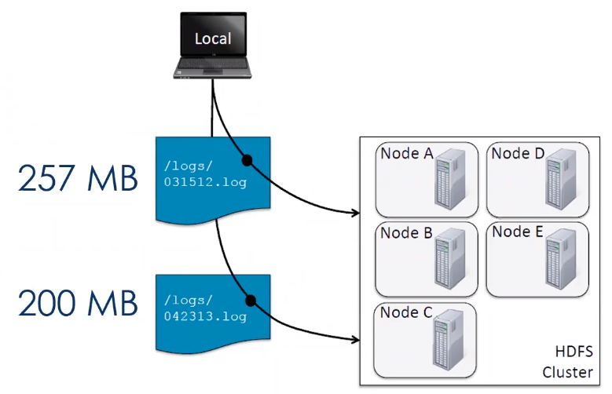

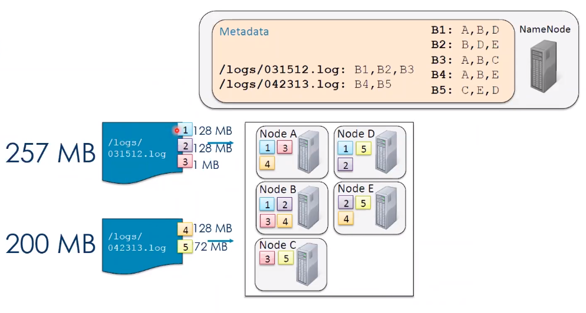

<br>

*PUT /GET*

- Copiar arquivo HDFS para local

  $ hdfs dfs -get /tmp/file_teste.txt

- Ingestão manual

  $ hdfs dfs -put file_teste.txt /user/everis-bigdata/

*Live Demo*

$ sudo -u hdfs hdfs dfs -chmod -R 777 /tmp
$ hdfs dfs -ls -h /
$ hdfs dfs -cat /tmp/file_teste.txt |head -10
$ hdfs dfs -rm /tmp/file_teste.txt
$ hdfs dfs -mkdir /tmp/delete
$ hdfs dfs –cp /tmp/file_teste.txt /tmp/delete/
$ hdfs dfs –touchz /tmp/delete/empty_file
$ hdfs dfs -rm -R /tmp/delete
$ hdfs dfs -du -h /user
$ hdfs fsck /tmp/ -files -blocks

<br>

*Start da Máquina Virtual*

​	usuario: everis

​	password: everis2021

ifconfig; endereço começando com 192.168.

*Caso não instalado: sudo yum install net-tools -y*

Utilizando o MobaXterm. Este Ip *(192.168.15.27)* foi encontrado utilizando o ifconfig

```bash
ssh 192.168.15.27 -l everis
```

Start NameNode

```bash
$ sudo service hadoop-hdfs-namenode start
```

```bash
$ sudo service hadoop-hdfs-secondarynamenode start
```

Verificar script_apoio

tmp

```bash
ll script_apoio/
```

```bash
sh script_apoio/start_all_service.sh
```

```bash
$ sudo service hadoop-hdfs-namenode start
$ sudo service hadoop-hdfs-secondarynamenode start
$ sudo service hadoop-hdfs-datanode start
$ sudo service hadoop-mapreduce-historyserver start
$ sudo service hadoop-yarn-resourcemanager start
$ sudo service hadoop-yarn-nodemanager start
```

```bash
$ hdfs dfs -get /tmp/file_teste.txt
```

```bash
$ hdfs dfs -put file_teste.txt /user/everis-bigdata/
```

Colocar a permissão antes

```bash
$ sudo -u hdfs hdfs dfs -chmod -R 777 /tmp
$ hdfs dfs -ls -h /
$ hdfs dfs -cat /tmp/file_teste.txt |head -10
$ hdfs dfs -rm /tmp/file_teste.txt
$ hdfs dfs -mkdir /tmp/delete
$ hdfs dfs –cp /tmp/file_teste.txt /tmp/delete/
$ hdfs dfs –touchz /tmp/delete/empty_file
$ hdfs dfs -rm -R /tmp/delete
$ hdfs dfs -du -h /user
$ hdfs fsck /tmp/ -files -blocks
```

Informações do arquivo

```bash
ll -h
```

*São dois sistemas de arquivos diferentes. hdfs e local*

No hdfs demora mais um pouco para ler por fazer todo o caminho, descrito no exemplo anterior.

Conectando o namenode

```bash
sudo -u hdfs hdfs fsck /tmp/ -files -blocks
```

Ele mostra os blocos. No exemplo, apnas 1 bloco pois é menor que 128MB. E só tem uma réplica. Under replicated.

/tmp/file_teste.text 4784 bytes

Mostra as informações do hdfs fsck

```bash
hdfs fsck
```

<br>

**Parte 3: YARN**

*Yet Another Resource Negotiator*

- Gerenciamento de recursos;
- Gerenciamento e monitoramento de Jobs;
- Recursos dos nós são alocados somente quando requisitado (via container).

*Componentes*

- **Application**: um job submetido ao Hadoop;
- **Application Master**: gerencia a execução e o escalonamento das tarefas (1 por aplicação);
- **Container**: unidade de alocação de recursos (ex. c1 = 1 GB RAM, 2 CPU);
- **Resource Manager**: gerenciador global de recursos;
- **Node Manager**: gerencia o ciclo de vida e monitora os recursos do Container.

*Execução de aplicação*

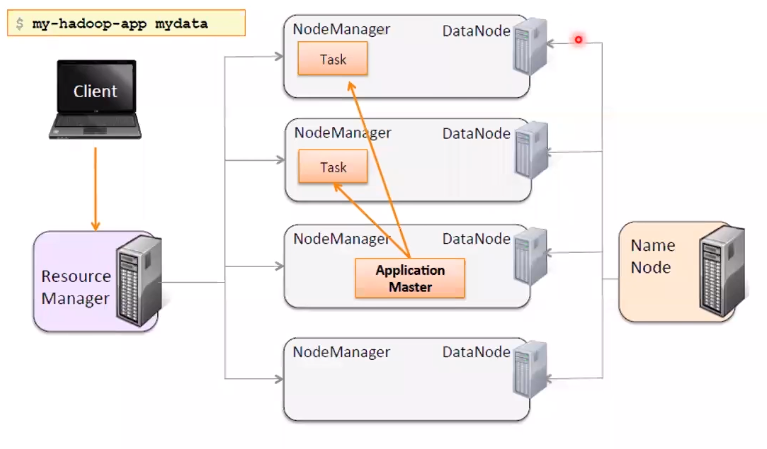


Log

```bash
sudo sed -i 's|hdfs://|hdfs://bigdata-srv:8020/|g'
/etc/hadoop/conf/yarn-site.xml
```

Jobs: O Hadoop Vai rodar alguns exemplos de MapReduce

```bash
sudo –u hdfs yarn jar /usr/lib/hadoop-mapreduce/hadoopmapreduce-examples.jar wordcount /tmp/file_teste.txt
/tmp/wc_output
```

*Pesquisar sobre exemplos na biblioteca exemplo de MapReduce.  https://stage.philipithomas.com/simple-mapreduce/*

<u>**Observação**</u>: Com o comando acima irá resultar uma url http://**bigdata-srv**:8088/...

Substituir **bigdata-srv** pelo ip da máquina. Neste exemplo, 192.168.15.27.

<u>192.168.15.27:8088/cluster</u> *Vai acessar o Hadoop com All Applications*

<br>

**<u>Restart</u>** 

- Parar tudo

  - Script de Apoio

    ```bash
    sh script_apoio/stop_all_service.sh
    ```

- Start

  - Script de Apoio

    ```bash
    sh script_apoio/start_all_service.sh
    ```

    

*Lendo o input e output da aplicação*

```bash
hdfs dfs -cat /tmp/file_teste.txt
```

```bash
hdfs dfs -ls /tmp/wc_output
```

Ler arquivo Log 

```bash
$ sudo -u hdfs yarn logs -applicationId
application_1611089476809_0001 |more
```

Converter para arquivo

```bash
sudo -u hdfs yarn logs -applicationId
application_1611089476809_0001 > wordcount.log
```

<br>

**<u>RESUMÃO</u>**

- **HDFS** é a camada de armazenamento do Hadoop;
  - Divide os dados em blocos e os distribui pelo cluster;
  - Os workers rodam o daemon DataNode e o master o daemon NameNode;

- **MAPREDUCE** foi o primeiro framework de computação distribuída utilizado com o HDFS;
  - Levou o processamento aos servidores onde o dado está armazenado.
- **YARN** gerencia os recursos no cluster
  - Trabalha com o HDFS para executar as tarefas quando o dado é armazenado;
  - OS workers rodam o daemon "NodeManager" e o master o daemon "ResourceManager";
  - É possível monitorar os jobs através da porta 8088.


<br>

Perguntas

- Problemas no ip. *Copiar ip desse arquivo*

  ```bash
  sudo vim /etc/hosts
  ```

  Comentar # o ip com o bigdata-srv. i ; esc :wq

<br>

<br>

<br>

------

## Orquestrando ambientes de big data distribuídos com Zookeeper, Yarn e Sqoop

*Aprenda mais sobre Zookeeper para gerenciar sistemas distribuídos,Sqoop para transferir dados entre bancos de dados relacionais e o Hadoop e gerencie os recursos de um cluster com Yarn.*

:calendar: 20/01/2021		:timer_clock: 20:00h		:hourglass: 2 horas	[:arrow_up:](#aceleração-global-dev-everis-4-rocket)

<br>

[Slides](/.pdfs/Aula-20-01-2021.pdf)

*Notas da live*

[Link da MV atualizado](https://hermes.digitalinnovation.one/files/acceleration/Everis_BigData-v3.ova)

<br>

**Parte 1: Zookeeper**

> Zookeeper e Sqoop em um ambiente clusterizado Hadoop

O que é o **Zookeeper**?

- Serviço de coordenação distribuído;
- Gerenciamento de um grande conjunto de hosts (nós);
- Arquitetura simples e API;
- Assim como o Hadoop, vem simplificar o processo do desenvolvedor;
- Fornece as rotas necessárias para as peças do cluster.
- Identifica os nós por nomes (DNS like);
- Gerencia e coordena as configurações;
- Funciona com esquema de eleição de líder (usar-se sempre pelo menos três Zookeeper);
- Pode indisponibilizar o dado enquanto está sendo modificado;
- Ajuda na recuperação automática de falhas (HBase, por exemplo).


**Arquitetura Zookeeper**

- **Leader:** responsável pelo processamento de requests de escrita. Eleito internamente. 
- **Followers:** recebem as requests de leitura

<br>

**Parte 2: Conceito Sqoop**

**Sqoop**

- Originalmente desenvolvido pela Cloudera;
- Movimenta dados entre **banco de dados relacional** e **HDFS**;
- Pode-se **importar** todas as tabelas, apenas uma tabela ou parte de uma tabela para o HDFS;
- Também permite **exportar** de dados do HDFS para um banco de dados;
- Permite **automatização** do processo de ingestão.

*Como funciona? (Ele é um pouco mais lento)*

- Realiza a leitura linha por linha da tabela para escrever o arquivo no HDFS;
- O resultado do import é um conjunto de arquivos contendo a cópia dos dados da tabela importada;
- Under the hood, gera classes Java, permitindo que o usuário possa interagir com o dado importado;
- Pode importar dados e metadados de bancos de dados SQL direto para o Hive;

- Utiliza MapReduce*(Não é tão performático)* para realizar import/ export dos dados, provendo um processamento paralelo e tolerante a falha.
- Permite especificar o intervalo e quais colunas serão importadas;
- Possibilita a especificação de delimitadores e formatos de arquivos;

- Realiza conexões com bancos de dados em **paralelo**, executando comandos de Select(import) e Insert/Update(export);
- Aceita conexão com diversos plug-ins: MySQL, PostgreSQL, Oracle, Teradata, Netezza, Vertica, DB2 e
SQL Server;
- O formato padrão do arquivo importado no HDFS é CSV.

*Exemplo*

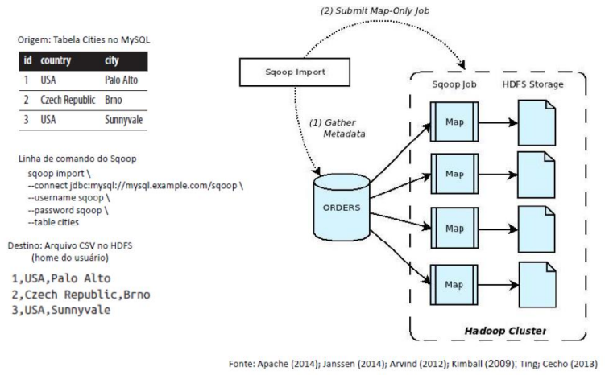

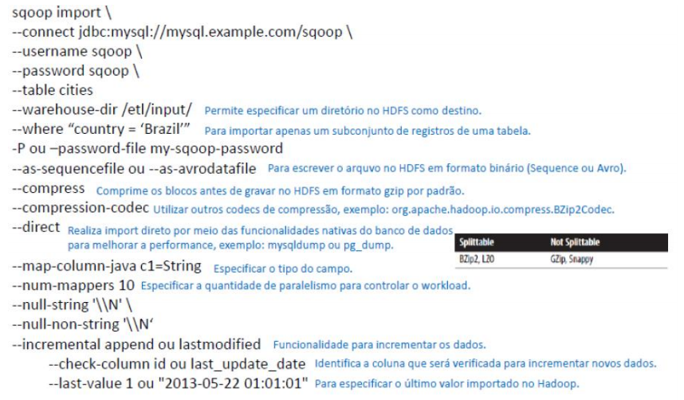

```shell
sqoop import \
--connect jdbc:mysql://mysql.example.com/sqoop \
--username sqoop \
--password sqoop \
--table cities
--warehouse-dir /etl/input/ # Pemite especificar um diretório no HDFS como destino
--where "country = 'Brazil'" # Pa importar apenas um subconjunto de registros de uma tabela
-P ou --password-file my-sqoop-password
--as-sequencefile ou --as-avrodatafile # Para escrever o arquivo no HDFS em formato binário (Sequence ou Avro)
--compress # Comprime os blocos antes de gravar no HDFS em formato gzip por padrão
--compression-codec # Utilizar outros codecs de compressão, exemplo: org.apache.hadoop.io.compress.BZip2codec
--direct # Realiza import direto por meio das funcionalidades nativas do BD para melhorar a performance, exemplo: mysqldump ou pg_dump
--map-column-java c1=String # Especificar o tipo do campo
--num-mappers 10 # Especificar a quantidade de paralelismo para controlar o workload
--null-string '\\N'\
--null-non-string '\\N'
--incremental append ou lastmodified # Funcionalidade para incrementar os dados
			--check-column id ou last_update_date # Identifica a coluna que será verificada para incrementar novos dados
			--last-value 1 ou "2013-05-22 01:01:01" # Para especificar o último valor importado no Hadoop
```

<br>

[Documentação do Sqoop](https://sqoop.apache.org/docs/1.4.6/index.html)

<br>

- Import da tabela accounts

```shell
sqoop import --table accounts \
--connect jdbc:mysql://dbhost/loudacre \
--username dbuser --password pw
```

- Import da tabela accounts utilizando um delimitador

```shell
sqoop import --table accounts \
--connect jdbc:mysql://dbhost/loudacre \
--username dbuser --password pw \
--fields-terminated-by "\t"
```

- Import da tabela accounts limitando os resultados

```shell
sqoop import --table accounts \
--connect jdbc:mysql://dbhost/loudacre \
--username dbuser --password pw \
--where "state='CA'"
```

- Import incremental baseado em um timestamp. Dve certificar-se de que esta coluna é atualizada quando os registros são atualizados ou adicionados.

```shell
sqoop import --table invoices \
--connect jdbc:mysql://dbhost/loudacre \
--username dbuser --password pw \
--incremental lasmodified \
--check-column mod_dt \
--last-value '2015-09-30 16:00:00'
```

- Import baseado no último valor de uma coluna específica

```shell
sqoop import --table invoices \
--connect jdbc:mysql://dbhost/loudacre \
--username dbuser --password pw \
--incremental append \
--check-column id \
--last-value 9878306
```

<br>
**Parte 3: Realizar uma ingestão com Sqoop**

- Instalando o Sqoop

[Comandos](/aula20-01-2021/Comandos.txt)

```shell
sudo yum install --assumeyes sqoop # Instalando
cd /tmp # Abre a pasta tmp
wget http://www.java2s.com/Code/JarDownload/java-json/java-json.jar.zip # Pega o arquivo zipado
unzip /tmp/java-json.jar.zip # Descompacta o arquivo
sudo mv /tmp/java-json.jar /usr/lib/sqoop/lib/ # Move o json para a lib do sqoop
sudo chown root: /usr/lib/sqoop/lib/java-json.jar # Altera o dono para o root
sqoop-version
```

Saída do sqoop-version

```bash
21/01/20 17:00:47 INFO sqoop.Sqoop: Running
Sqoop version: 1.4.6-cdh5.16.2
Sqoop 1.4.6-cdh5.16.2
git commit id
Compiled by jenkins on Mon Jun 3 03:34:57 PDT 2019
```

Pegar [install_sqoop.sh](/aula20-01-2021/install_sqoop.sh) , para automatizar.

```shell
vim install_sqoop.sh
```

Clique **i** teclado. Pra colar **shift+insert**. **Esc:wq**

```shell
sh install_sqoop.sh
[sudo] password for everis: everis2021
```

**OBS:** A VM precisa ter acesso a internet.

<br>

**HANDS-ON!**

Arquivos necessários:

- [install_sqoop.sh](/aula20-01-2021/install_sqoop.sh)
- [pokemon.sql](/aula20-01-2021/pokemon.sql)
- [sqoop_import.sh](/aula20-01-2021/sqoop_import.sh)

Colocar comando e colar os arquivos acima. Cada arquivo

```shell
vim install_sqoop.sh
vim pokemon.sql
sqoop_import.sh
```

Rodar o sql dentro do mysql

```shell
mysql -u root -h localhost -pEveris@2021 < pokemon.sql
```

Verificando a existência da tabela

```shell
mysql -u root -h localhost -pEveris@2021
```

Rodar as linhas do arquivo [dontpad](/aula20-01-2021/dontpad.txt)

*Primeira linha somente pra não identificar a segunda linha como password*

```shell
sudo service hadoop-hdfs-namenode start
```

Restante das linhas

```shell
sudo service hadoop-hdfs-secondarynamenode start
sudo service hadoop-hdfs-datanode start
sudo service hadoop-yarn-nodemanager start
sudo service hadoop-yarn-resourcemanager start
sudo service hadoop-mapreduce-historyserver start
sudo service zookeeper-server start
```

sh sqoop_import.sh

O Conteudo está abaixo

```shell
echo "Apagando diretório de output"
sudo -u hdfs hdfs dfs -rm -R /user/everis-bigdata/pokemon

echo "Importando a tabela"
sudo -u hdfs sqoop import \

--connect jdbc:mysql://localhost/trainning \
--username root --password "Everis@2021" \
--fields-terminated-by "|" \
--split-by Generation \
--target-dir /user/everis-bigdata/pokemon \
--query 'SELECT * FROM pokemon WHERE $CONDITIONS' \
--where 'Number IS NOT NULL' \
--compress \
--num-mappers 4
```

-- Vai importar as tabelas, número de linhas, url yarn

-- Precisa modificar a url com o ip da máquina

```shell
ip addr show
```

Exemplo da aula: 

192.168.15.27:8088/proxy/application_1611167972762_0025/

192.168.15.27:8088

*O Sqoop gera um jar, e aplicação MapReduce*. Retrieved 800 records.

Listando

```shell
hdfs dfs -ls /user/everis-bigdata/pokemon
```

Ler arquivos

```shell
hdfs dfs -text /user/everis-bigdata/pokemon/part-m-00000.gz
```

<br>

**Exercícios**

Import subsets com Sqoop seguindo as seguintes premissas:
1. Todos os Pokémon lendários;
2. Todos os Pokémon de apenas um tipo;
3. Os top 10 Pokémon mais rápidos;
4. Os top 50 Pokémon com menos HP;
5. Os top 100 Pokémon com maiores atributos;

<br>

*Testando a query*

```shell
mysql -u root -h localhost -pEveris@2021
```

No Mysql. Exercício 1, todos os lendários

```sql
SELECT * FROM trainning.pokemon WHERE Legendary IS true
```

Retorno: 65 rows in set

No **Sqoop** 

```shell
sudo -u hdfs sqoop import \
```

String de conexão

```shell
--connectjdbc:mysql://localhost/trainning \
--username root --password "Everis@2021" \
--direct \
--table pokemon \
--target-dir /user/everis-bigdata/pokemon/1 \
--where "Legendary=1"
```

Retorno: 65 rows in set

Verificando o diretório

```shell
hdfs dfs -ls /user/everis-bigdata/pokemon/1
```

Found 5 items

Ler todos os arquivos

```shell
hdfs dfs -cat /user/everis-bigdata/pokemon/1/*
```

Contando as linhas

```shell
hdfs dfs -ls /user/everis-bigdata/pokemon/1/* |wc -l
```

Retorno 65

<hr>

Para o Exercício 2, vai utilizar da mesma forma

```shell
--connectjdbc:mysql://localhost/trainning \
--username root --password "Everis@2021" \
--direct \
--table pokemon \
--target-dir /user/everis-bigdata/pokemon/1 \
--where "Legendary=1"
```

*Dicas*

Verificar o yarn

```shell
sudo service hadoop-yarn-resourcemanager status
```

ifconfig

Spoilers Aceleração dos desafios

```shell
SELECT * FROM trainning.pokemon WHERE Legendary IS true; (65)
SELECT * FROM trainning.pokemon WHERE Type2 = ""; (386)
SELECT * FROM trainning.pokemon ORDER BY Speed DESC LIMIT 10;
SELECT * FROM trainning.pokemon ORDER BY HP LIMIT 50;
SELECT Number, Name, SUM(HP+Attack+Defense+SpAtk+SpDef+Speed) AS Total FROM trainning.pokemon GROUP BY Number ORDER BY Total DESC LIMIT 100;

sudo -u hdfs sqoop import \
--connect jdbc:mysql://localhost/trainning \
--username root --password "Everis@2021" \
--direct \
--table pokemon \
--target-dir /user/everis-bigdata/pokemon/1 \
--where "Legendary=1"

sudo -u hdfs sqoop import \
--connect jdbc:mysql://localhost/trainning \
--username root --password "Everis@2021" \
--direct \
--table pokemon \
--target-dir /user/everis-bigdata/pokemon/2 \
--where "Type2=''"

sudo -u hdfs sqoop import \
--connect jdbc:mysql://localhost/trainning \
--username root --password "Everis@2021" \
--split-by 1 \
--target-dir /user/everis-bigdata/pokemon/3 \
--query 'SELECT * FROM pokemon WHERE $CONDITIONS ORDER BY Speed LIMIT 10'

sudo -u hdfs sqoop import \
--connect jdbc:mysql://localhost/trainning \
--username root --password "Everis@2021" \
--split-by 1 \
--target-dir /user/everis-bigdata/pokemon/4 \
--query 'SELECT * FROM pokemon WHERE $CONDITIONS ORDER BY HP LIMIT 50'

sudo -u hdfs sqoop import \
--connect jdbc:mysql://localhost/trainning \
--username root --password "Everis@2021" \
--split-by 1 \
--target-dir /user/everis-bigdata/pokemon/5 \
--query 'SELECT Number, Name, SUM(HP+Attack+Defense+SpAtk+SpDef+Speed) AS Total FROM pokemon WHERE $CONDITIONS GROUP BY Number ORDER BY Total DESC LIMIT 100'
```

<br>

<br>

<br>

------

## Como realizar consultas de maneira simples no ambiente complexo de BigData com HIVE e Impala

*Aprenda mais sobre Hive e Impala*

:calendar: 21/01/2021		:timer_clock: 20:00h		:hourglass: 2 horas	[:arrow_up:](#aceleração-global-dev-everis-4-rocket)

<br>

[Slides](/.pdfs/Live-21-01-2021-Hive_Impala.pdf)

*Notas da live*

#### Introdução

HQL: Hive Query Language

- Hive é uma abstração em alto nível do MapReduce

- Impala é um motor SQL de alta performance. O Impala não salva resultados intermediários no disco.

#### **Arquitetura Hive**

UI -> Driver -> Compiler -> Engine

O Impala consome muita memória

#### **Metastore**

Hive e Impala trabalham com o mesmo dado. Tabelas no HDFS, metadado e metastore.

Caminho padrão: /user/hive/warehouse/<table_name>

#### Modelo de dados

Dados em tabelas e partições

#### Database

```sql
CREATE DATABASE loudacre;
CREATE DATABASE IF NOT EXISTS loudacre;

DROP DATABASE loudacre;
```

/user/hive/warehouse/loudacre.db

#### Table

```sql
CREATE TABLE jobs (
	id INT,
	title STRING,
	salary INT.
	posted TIMESTAMP
)
ROW FORMAT DELIMITED
FIELDS TERMINATED BY ',';
```

Tabela Gerenciada e tabela Externa

#### Formatos de arquivos

- Parquet
- Avro (.avsc)
- Orc

#### Tipos de Tabelas

External Table: Hive assume que não gerencia os dados.

Managed Table: hdfs

#### Particionamento

Performance e leitura no cluster. Não particione pouco demais e nem demais.

#### Parte Prática

Foi utilizado a VM3

<u>Acessando o Hive e Impala</u>

Pelo putty. Alguns comandos úteis

```shell
hive
```

```shell
impala-shell
```

```shell 
hadoop -h
man hadoop
man hdfs
```

No Hive

```shell
show database
create database teste01;
```

Para criar Tabela. Obs: Cuidado para não inserir no default. `create table teste01.teste01 (id int);`

Mostrar todas as tabelas `show tables;`

Printar o header  `set hive.cli.print.header=true;`

`use teste01`

Inserindo dados

```sql
insert into table teste01 values(1);
```

`show tables;` *Exibe as tabelas*

Exibindo os BD e tabelas

```shell
hdfs dfs -ls /user/hive/warehouse
```

```shell
hdfs dfs -ls /user/hive/warehouse/teste01.db/teste01
```

*Quando não especifico o tipo da tabela, por default fica do tipo Gerenciada.*

#### Criando uma tabela Externa

```sql
create external table teste03 (id int);
```

```sql
show create table teste01;
```

*Carregando arquivos*. Tipo string

```shell
ls -ltrh
cat employee.txt
```

Dentro do terminal do <u>Hive</u>. Limpar a tela tipo o clear no Linux. `!clear`

- `!clear`
- `!pwd`
- `!ls -ltrh;`

Criando uma tabela no Hive

```sql
CREATE EXTERNAL TABLE TB_EXT_EMPLOYEE (
      id STRING,
      groups STRING,
      age STRING,
      active_lifestyle STRING,
      salary STRING)
      ROW FORMAT DELIMITED FIELDS
      TERMINATED BY '\;'
      STORED AS TEXTFILE
      LOCATION '/user/hive/warehouse/external/tabelas/employee'
      tblproperties ("skip.header.line.count"="1"); 
```

Verificando o arquivo

```shell
hdfs dfs -ls /user/hive/warehouse/external/tabelas/employee
```

```shell
hdfs dfs -ls /user/hive/warehouse/external/tabelas
```

Colocar o arquivo emplyee.txt dentro do diretório ../tabelas/employee

```shell
hdfs dfs -put /home/everis/employee.txt /user/hive/warehouse/external/tabelas/employee
```

Visualizar o conteúdo

```shell
hdfs dfs -cat /user/hive/warehouse/external/tabelas/employee/employee.txt
```

Selecionando dados da tabela

```sql
select count(*) from tb_ext_employee;
```

Dar privilégio para arquivos. *Muito parecido com linux.*

```shell
hdfs dfs -ls /user/hive/warehouse/external/tabelas/employee
hdfs dfs -chmod 775 /user/hive/warehouse/external/tabelas/employee
hdfs dfs -ls /user/hive/warehouse/external/tabelas/employee
```

~~*Procurar tratamento dos dados para inserção.*~~

Criar outra tabela

```sql
CREATE TABLE TB_EMPLOYEE(
      id INT,
      groups STRING,
      age INT,
      active_lifestyle STRING,
      salary DOUBLE)
      PARTITIONED BY (dt_processamento STRING) #Coluna do tipo partição.
      ROW FORMAT DELIMITED FIELDS TERMINATED BY '|'
      STORED AS PARQUET TBLPROPERTIES ("parquet.compression"="SNAPPY"); #formato parquet Snappy
```

Inserindo dados. 

```sql
insert into table TB_EMPLOYEE partition (dt_processamento='20201118')
      select 
      id,
      groups,
      age,
      active_lifestyle,
      salary
      from TB_EXT_EMPLOYEE;
```

Verificando..

```shell
hdfs dfs -ls /user/hive/warehouse/teste01.db/tb_employee
```

```shell
#Copiar arquivo para o disco local
hdfs dfs -copyToLocal /user/hive/warehouse/teste01.db/tb_employee/dt_processamento=20201118/000000_0 .

#Visualizar info do schema utilizando o parquet-tools
parquet-tools schema 000000_0
```

Criando tabela

```sql
create external table localidade(
      street string,
      city string,
      zip string,
      state string,
      beds string,
      baths string,
      sq__ft string,
      type string,
      sale_date string,
      price string,
      latitude string,
      longitude string)
      PARTITIONED BY (particao STRING)
      ROW FORMAT DELIMITED FIELDS TERMINATED BY ","
      STORED AS TEXTFILE
      location '/user/hive/warehouse/external/tabelas/localidade'
      tblproperties ("skip.header.line.count"="1");
```

Dentro do Hive, load de um arquivo

```shell
load data local inpath '/home/everis/base_localidade.csv'
into table teste01.localidade partition (particao='2021-01-21');
```

Conferindo...

```sql
select count(*) from localidade;
```

No HDFS...

```shell
hdfs dfs -ls /user/hive/warehouse/external/tabelas/localidade/particao=2021-01-21
```

Visualizando o conteúdo do arquivo

```shell
hdfs dfs -cat /user/hive/warehouse/external/tabelas/localidade/particao=2021-01-21/base_localidade.csv
```

Criando tabela parquet

```sql
create table tb_localidade_parquet(
      street string,
      city string,
      zip string,
      state string,
      beds string,
      baths string,
      sq__ft string,
      type string,
      sale_date string,
      price string,
      latitude string,
      longitude string)
      PARTITIONED BY (particao STRING)
      STORED AS PARQUET;
```

Inserindo dados.

```sql
INSERT into TABLE tb_localidade_parquet
      PARTITION(PARTICAO='01')
      SELECT
      street,
      city,
      zip,
      state,
      beds,
      baths,
      sq__ft,
      type,
      sale_date,
      price,
      latitude,
      longitude
      FROM localidade;
```

#### Acessando o Impala

```shell
impala-shell
show databases;
```

Não está aparecendo o database 01 porque quando a tabela é criada no Hive, vamos precisar atualizar essa informação para o Impala. Porque o Impala já leu *metastore*. Precisamos dar um refresh.

```sql
select * from tb_localidade_parquet
show tables;
```

Queremos visular essa tabela no Impala. Como?

Vamos invalidar os dados.

```shell
INVALIDATE METADATA teste01.tb_localidade_parquet;
```

```shell
show databases
show tables
```

*Obs: Se o Impala não estiver no ar, rodar novamente o script. Isso pode acontecer devido a falta de recursos(memória) da máquina. Vai precisar para alguns serviços pra funcionar melhor*

Conferindo ... `use teste01;` e `show tables;`

Precisamos invalidar as outras tabelas também.

```shell
INVALIDATE METADATA teste01.localidade;
```

Verificando relacionamento entre as tabelas com o comando `desc tb_ext_employee;`. Mesmo sem chave estrangeira podemos relacionar várias tabelas.

```sql
select
      tab01.id,
      tab02.zip
      from tb_ext_employee tab01
      full outer join tb_localidade_parquet tab02
      on tab01.id = tab02.zip;
```

```sql
select
      tab01.id,
      tab02.zip,
      "teste" col_fixa,
      concat(tab01.id, tab02.zip) as col_concatenada
      from tb_ext_employee tab01
      full outer join tb_localidade_parquet tab02
      on tab01.id = tab02.zip;
```

Criada o relacionamento entre uma coluna fixa e outra concatenada.

Em um arquivo real.

Help do hive

```shell
hive -H
```

Vai acessar o Hive, utilizar o select e sair do Hive

```shell
hive -S -e "select count(*) from teste01.localidade;"
```

#### Script Exemplo do Hive

```shell
#!/bin/bash

dt_processamento=$(date '+%Y-%m-%d')
path_file='/home/cloudera/hive/datasets/employee.txt'
table=beca.ext_p_employee
load=/home/cloudera/hive/load.hql

hive -hiveconf dt_processamento=${dt_processamento} -hiveconf table=${table} -hiveconf path_file=${path_file} -f $load 2>> log.txt

hive_status=$?

if [ ${hive_status} -eq 0 ];
then
        echo -e "\nScript executado com sucesso"
else
        echo -e "\nHouve um erro na ingestao do arquivo"
impala-shell -q 'INVALIDATE METADATA beca.ext_p_employee;'

fi 

LOAD DATA LOCAL INPATH '${hiveconf:path_file}' INTO TABLE ${hiveconf:table} PARTITION(dt_processamento='${hiveconf:dt_processamento}');
```

<br>

*<u>Perguntas</u>*

- Ferramenta HUE;

<br>

<br>

<br>

------

## Explorando o poder do NoSQL com Cassandra e Hbase

*Aprenda como trabalhar com NoSql trabalhando com o banco de dados Cassandra e Hbase.*

:calendar: 22/01/2021		:timer_clock: 20:00h		:hourglass: 2 horas	[:arrow_up:](#aceleração-global-dev-everis-4-rocket)

<br>

[Slides](/.pdfs/Live-22-01-2021-Cassandra.pdf)

*Notas da live*

#### Parte 1: Conceito NoSQL e porquê utilizamos no Big Data?

Significados: 

NoSQL = “No SQL”, “Não SQL” ou “Não Relacional” 

NoSQL = “Not Only SQL” 

Termo genérico para representar os bancos de dados não relacionais. 

O NoSQL emergiu como uma alternativa de banco de dados não relacionado, normalmente evitando operações de “join”, é distribuído, open-source, escalável na horizontal, livre de modelagens ou schema (não é necessário fixar modelos para as tabelas), suporta replicação, acesso via API de operações e eventualmente consistente.

**Relacional vs NoSQL**             

| Quando considerar NoSQL                                      | Quando considerar Relacional                                 |
| ------------------------------------------------------------ | ------------------------------------------------------------ |
| Carga de trabalho de alto volume que exigem grande escala    | Carga de trabalho é consistente e requer escala média para grande |
| Carga de trabalho não exigem garantias do ACID               | Garantias de ACID são necessárias                            |
| Os dados são dinâmicos e frequentemente alterados            | Dados são previsíveis e altamente estruturados               |
| Os dados podem ser expressos sem relações (joins)            | Os dados são expressos de maneira relacional                 |
| Alto velocidade de gravação e a segurança de gravação não é crítica | A garantia de gravação é um requisito                        |
| Consulta de dados é simples e tende a ser simples            | Consultas e relatórios complexos                             |
| Dados exigem uma ampla distribuição geográfica               | Usuários são mais centralizados                              |

**Tipos de NoSQL**

- **SQL**
  - Relational
  - Analytical (OLAP)
- **NoSQL**
  - Key-Value
  - Column-Family
  - Graph
  - Document

**Teorema de CAP**

O teorema CAP ou teorema de Brewer indica que o armazenamento de dados distribuídos só podem atender dois dos três atributos: **Consistência, Disponibilidade, Partição Tolerante a Falhas.**

Tanto Hadoop e HBase atendem CP, porque possuem um ponto de falha que é respectivamente o NamedNode e HMaster que não possuem redundância dos dados dos próprios serviços para todos os nós do cluster.

**Por quê NoSQL no Big data?**

Limitações do Hadoop

- Hadoop (MapReduce) pode executar apenas processamento batch e os dados são acessados de forma sequencial, isso significa que é necessário percorrer todo o conjunto de arquivos (scan search) mesmo para os jobs mais simples.

Cenário

- Um grande conjunto de dados (dataset) quando processado com um outro conjunto de dados, ambos serão processados de maneira sequencial, nesse momento uma nova solução é necessária para acessar qualquer ponto do dataset (linhas) e que leve um tempo menor para retornar.
- Aplicações como HBase, Cassandra, Dynamo e MongoDB, etc, são banco dados que armazenam grandes quantidade de dados e os acessos à esses dados são realizados de forma aleatória em termos de posição do registro e do tempo.

#### Parte 2: Introdução HBase e Cassandra

**O que é o Apache Hbase?**

**HBase** é um banco de dados distribuído e orientado a colunas (Column Family ou Wide Column).

Uma definição mais técnica:

O armazenamento do HBase é um esparso, distribuído, persistente, multidimensional e ordenado **Map**.

As maiores desvantagens do Hbase é não ter uma linguagem própria de SQL, não suportar índices em colunas fora do rowkey e não suportar tabelas secundárias de índices.

A maior vantagem é a facilidade e integração com o ecossistemas Hadoop.

**Map** é indexado por uma linha chave (row key), coluna chave (column key), e um coluna timestamp.

Cada valor no Map é interpretado como um vetor de bytes (array of bytes).

O **array of bytes** nos permite gravar portanto qualquer informação se for necessário, inclusive documentos, arquivos JSON, CSV, etc.

Portanto podemos entender que o núcleo de dados do HBase é um Map.

Na maioria das linguagens de programação essa abstração de estrutura de dados existe e pode ser representada como um conjunto de chaves e conjunto de valores. Cada chave é associada à um valor.

```json
{
    "zzzzz" : "Olá",
    "xyz" : "hello",
    "aaaab" : "world Hbase!",
    "1" : "x",
    "aaaaa" : "y"
} 
```

**Multidimensional e Ordenado**
Esquecendo o conceito tradicional de linhas e colunas do mundo relacional, pense no multidimensional como um Map que contém Maps.

Column Families

**Arquitetura do HBase**

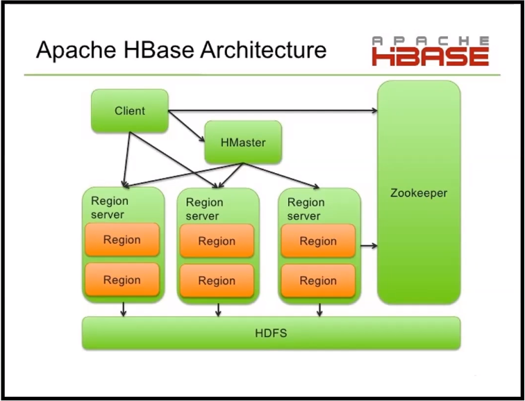

*Zookeeper: faz os nós conversarem entre si*

##### HBase Client

Responsável por encontrar o RegionServers que estão atendendo as linhas em particular que estão sendo  utilizadas, para isso é consultado uma base de dados de metadados interna do Hbase, **hbase:meta** que fica no Zookeeper. 

Depois de localizado o RegionServer, o client se comunica para solicitar requisição de leitura/gravação do registro, isso até versão 2.x.y.

Apartir da versão 3.x.y. o HMaster controla as requisições leitura/gravação.

Caso ocorra erro na comunicação com o RegionServer por alguma falha será atribuído pelo load balancer do HMaster um novo RegionServer.

##### HMaster

Responsável por monitorar todos as instâncias de RegionServer no cluster. É meio para todas as  solicitações de mudanças de metadados. 

Em um ambiente distribuído de produção esse serviço é executado no NamedNode do Hadoop. 

É possível ter vários nós de um ambiente clusterizado atuar como master, porém só um pode ficar ativo, o restante fica passivo, caso ocorra alguma falha no master principal.

##### RegionServer

Responsável por monitorar todos as instâncias de RegionServer no cluster. É meio para todas as solicitações de mudanças de metadados. 

Em um ambiente distribuído de produção esse serviço é executado no NamedNode do Hadoop. 

É possível ter vários nós de um ambiente clusterizado atuar como master, porém só um pode ficar ativo, o restante fica passivo, caso ocorra alguma falha no master principal.

##### Regions

Representam os elementos básicos de disponibilidade e distribuição das tabelas e incluem o armazenamento de cada column family.

Hierarquia dos Objetos no HBase

```
Table (Tabela HBase)
	Region (Regiões da tabela)
		Store (Unidade de armazenamento por ColumnFamily para cada região da tabela)
			MemStore (MemStore para cada armazenamento em cada região da tabela)
			StoreFile (StoreFiles para cada armazenamento em cada região da tabela)
				Block (Arquivos que servem como blocos dentro do StoreFile dentro do armazenamento em cada região de uma tabela)
```

##### Apache Zookeeper

O tipo de instalação distribuída do Hbase é necessário que o Apache Zookeeper esteja funcionando no cluster. 

O Apache Zookeeper é o responsável por dar visibilidade a todos os nós de serviços do HBase de quem é o master atual, são os servidores que atendem ao papel RegionServers, Region. Toda configuração que é
padrão para cada um dos papéis são armazenados no Zookeeper, portanto ele tem um papel fundamental de manter sincronizado toda a parametrização em comum para todos os nós. 

O cliente HBase se comunica com os RegionServer através do Zookeeper.

**Apache HDFS**

É o sistema de arquivos do ecossistema do Hadoop. Cada arquivo está armazenado em múltiplos blocos e mantem tolerância a falhas, os blocos são replicados pelos cluster Hadoop.

HDFS é utilizado pelo componentes do HBase. 

Os arquivos gerenciados pelo HBase são criados dentro do HDFS.

| HBASE                                                        | HDFS com Hive/MR                                          |
| ------------------------------------------------------------ | --------------------------------------------------------- |
| Baixa latência nas operações                                 | Alta latência nas operações                               |
| Acesso a leitura e gravação aleatória                        | Grava única e leitura muita vezes                         |
| Acessado através de comandos shell, cliente API em Java, REST, Avro ou Thrift | Acessado primeiramente através dos Jobs do MR(Map Reduce) |

**O que é o Apache Cassandra?**

O Cassandra é um banco de dados distribuído e orientado a colunas (Wide Column).
Diferente do Hbase, os dados armazenados são tipados e há conceitos mais complexos de modelagem como chave primária composta, partition key e cluster key.
O Cassandra possui a linguagem SQL (CQL) contém semelhante com SQL ANSI porém algumas operações não são suportadas / recomendadas, por exemplo: joins, alguns tipos de agrupamentos e tipos de filtros.

A recomendação para modelagem de dados no Cassandra, é pensar em quais query devem ser onsumidas e agregar as informações em uma determinada tabela.

Uma grande diferença para o Hbase, é que o <u>Cassandra suporta tabela secundárias de índices e permite filtros em colunas fora da primary key</u>.

##### Arquitetura do Cassandra

A característica principal do Cassandra é armazenar em múltiplos nós sem nenhum ponto de falha. Conexão entre os nós é realizada de ponto a ponta, utilizando um protocolo chamado **Gossip**.

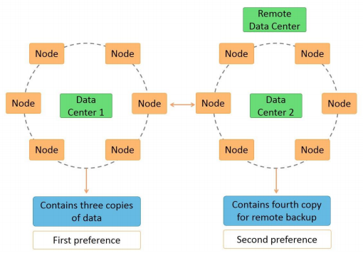

##### Componentes do Cassandra

- **Node**: Nó responsável por armazenar os dados, é um componente básico da Arquitetura.
- **Data Center**: Representa uma coleção de nós.
- **Cluster**: Representa a coleção de vários Data Centers.
- **Commit Log**: Cada operação é escrita no log de commit. Esse logo é utilizado para recuperação em
  caso de incidents graves.
- **Mem-table**: Depois que o dado é escrito no log de commit, o dado é escrito no Mem-table. O dado
  nessa localidade é temporário. 
- **SSTable**: Quando o Mem-Table atingi um limite, o dado é gravado no disco no SSTABLE.

#### Parte 3: Comandos Gerais

**hbase shell**

> No console do HBase é possível u tilizar todos os comandos de manipulação de
> informação e comandos gerais.
> Atualmente o HBase até a versão 3.x.y não suporta uma query de consulta (SQL).
> Os comandos mais básicos de manipulação das informação são: put, get, scan,
> drop, disable, etc.

**status**

> Comando dá detalhes sobre o sistema como o número de servidores presente, quantidade
> de servidores ativos, média de carga, quantidade de Stored ativos, é possível passar qualquer parâmetro dependendo em qual detalhe seja necessário saber sobre o sistema.
>
> Variações 
>
> - status 'simple'
>
> - status 'summary'
>
> - status 'detailed'

**version**

> Exibe a versão do HBase. 

**table_help**

> Comando que auxilia como utili zar comandos que se referenciam a uma tabela.
> É possível pegar a referencia de uma tabela cria e utilizar como variável para próximas
> operações.

##### Os comandos abaixo são utilizados para operar as tabelas no HBase.

- **create** – Cria uma tabela.
- **list** – Lista todas as tabelas no HBase independente do namespace.
- **disable** – Desabilita uma tabela.
- **is_disabled** – Checa se uma tabela está desabilitada.
- **enable** – Habilita uma tabela.
- **is_enabled** – Checa se uma tabela está habilitada.
- **describe** – Exibe informações de definição de uma tabela.
- **alter** – Realiza alterações em uma tabela.
- **exists** – Verifica se uma tabela existe.
- **drop** – Exclui um tabela do HBase.
- drop_all – Exclue todas as que se aplicam a um padrão de nomes via regra de Regex.

**CREATE_NAMESPACE**

> Permite criar uma namespace no HBase.
> <u>Sintaxe:</u>
> create_namespace '<namespace>' {PROPRIEDADES}
> <u>Exemplo:</u>
> create_namespace 'empresa'

**CREATE**

> Permite criar uma tabela no HBase.
> <u>Sintaxe:</u>
> create '[<namespace>]:<nome tabela>', '<nome da column family>' {PROPRIEDADES}
> <u>Exemplo:</u>
> Imagine uma tabela de funcionarios

| Row key | Dados Pessoais | Dados Profissional |
| ------- | -------------- | ------------------ |
|         |                |                    |
|         |                |                    |

##### Exemplo criação da tabela de funcionários

Comando:

```sql
create 'funcionario', 'pessoais', 'profissionais'
create 'funcionario', {NAME=>'pessoais', VERSIONS=>5}, {NAME=> 'profissionais',
VERSIONS =>4}
```

Liste todas as tabelas

**list**

Com o comando list é possível visualizar todas as tabelas presentes e criados no
HBase.
É possível passar expressões regulares para realizar buscas mais personalizadas.

**DESCRIBE**
O comando exibe informações sobre as column families presentes na tabela
mencionada, também traz informações sobre os filtros associados, versões, se
a tabela está em memória, etc.
<u>Sintaxe:</u>
describe '<nome da tabela>'
<u>Comando:</u>
describe 'funcionario'

**DISABLE**
Desabilita a tabela mencionada, caso seja necessário que uma tabela seja deletada ou excluída, primeiro é necessário desabilita-la.
Após desabilitada ainda é possível lista-la (list) em conjunto com as demais tabelas e checar sua existência com comando exists, porém não é possível mais escanear (scan).
<u>Sintaxe:</u>
disable '<nome da tabela>'
<u>Comando:</u>
disable 'funcionario'

**DISABLE_ALL**
Desabilita as tabelas que atendem dentro do critério de expressão regular.

Para evitar interrupções importantes esse comando tem uma confirmação manual (Sim ou Não) antes de efetivar a desabilitação.
<u>Sintaxe:</u>
disable_all '<prefixo da tabela>.'
<u>Comando:</u>
disable_all 'func.'

**ENABLE**
Habilita a tabela mencionada no comando. Se a tabela está desabilitada no primeiro momento e não foi deletada ou excluída, e desejamos reutilizar a tabela, então primeiro nos precisamos habilita-la novamente.
<u>Sintaxe:</u>
enable '<nome da tabela>'
<u>Comando:</u>
enable 'funcionario

**DROP**
Para deletar ou dropar uma tabela presente no HBase, primeiro é necessário desabilita-lá com o comando disable.
<u>Sintaxe:</u>
drop '<nome da tabela>'
<u>Comando:</u>
drop 'funcionario'

**DROP_ALL**
Esse comando excluirá todas as tabelas que estiverem com o nome dentro da regra da expressão regular.
Todas as tabelas que serão excluídas, precisam estar na situação de desabilitadas, portanto ter passado pelo comando disable_all.
<u>Sintaxe:</u>
drop_all '<expressão regular>'
<u>Comando:</u>
drop_all 'func.*'

**IS_ENABLED**
Esse comando só verificará se a tabela está habilitada ou não. Caso esteja desabilitada é necessário acionar o outro comando enable.
<u>Sintaxe:</u>
is_enabled '<nome da tabela>'
<u>Comando:</u>
is_enabled 'funcionario

**ALTER** (Acrescentando column family e limitando versões da coluna)
Esse comando alterará a definição (schema) da família de colunas (column family) de uma tabela especificada.
Alterar uma única ou múltiplas column family.
Deletar column family
Diversas operações são permitidas utilizando atributos específicos de definição de uma tabela.
Sintaxe:

alter '<nome da tabela>', NAME=><column familyname>, VERSIONS => 5

Exemplo comando abaixo para limitar armazenamento até 5 versões da column family

alter 'funcionario', NAME => 'hobby', VERSIONS => 5
alter 'funcionario', 'delete'=>'hobby' (Para deletar)

**ALTER_STATUS**
Com esse comando é possível acompanhar com o status das alterações realizada de uma tabela para todos nós RegionServer.
<u>Sintaxe:</u>
alter_status '<nome da tabela>'
<u>Comando:</u>
alter_status 'funcionario'

<br>

Os comandos abaixo são utilizados para operar os dados no HBase.

- **put** – Insere/Atualiza um valor em uma determinada célula de uma específica linha de uma
  tabela.
- **get** – Consulta todo o conteúdo de uma linha ou célula em uma tabela.
- **delete** – Exclui um valor de uma célula em uma tabela.
- **deleteall** – Exclui todas as células de uma linha em específico.
- **scan** – Varre toda a tabela retornando as dados contidos.
- **count** – Conta e retorna o número de linhas em uma tabela.
- **truncate** – Desabilita, exclui e recria uma tabela em específico.

*<u>IMPORTANTE</u>: Todas as operações de CRUD lista acima estão disponíveis via API Java de*
*utilização sob o pacote org.apache.hadoop.hbase.cliente com os objetos Htable Put e Get.*

<br>

**PUT**
Comando para inserir um determinado valor em uma célular na coluna ou linha.
Também utilizado para atualizar um determinado valor de uma célula para um determinado
rowKey e ColumnFamility:colname já existente.
<u>Sintaxe:</u>
put '<nome da tabela>', '<rowkey>', '<columnfamily:colname>', '<valor>'
<u>Comando:</u>

```sql
put 'funcionario', '1', 'pessoais:nome', 'Maria'
put 'funcionario', '1', 'pessoais:cidade', 'São Paulo'
put 'funcionario', '1', 'pessoais:cidade', 'Belo Horizonte'
put 'funcionario', '2', 'profissionais:empresa', 'Everis'
scan 'funcionario', {VERSIONS => 3}
```

**GET**
Comando retorna um determinado valor em uma célula na coluna ou linha inteira do rowKey.
<u>Sintaxe:</u>
get '<nome da tabela>', '<rowkey>', [parâmetros opcionais]
<u>Comando:</u>
get 'funcionario', '1'
get 'funcionario', '1', {COLUMN => 'pessoais:cidade'}

Consultar todas as versões de uma column para um rowkey específico get 'funcionario', '1' , {COLUMN => 'pessoais:cidade', VERSIONS=> 3}

**COUNT**
Comando recupera a quantidade de linhas de uma determinada tabela.
O Intervelo de contagem de linhas pode ser especificado de forma opcional.
A contagem de linhas é exibida a cada 1000 linhas.
<u>Sintaxe:</u>
count '<nome da tabela>', CACHE => 1000
<u>Comando:</u>
count 'funcionario', CACHE=> 1000

**DELETE**
Comando remove um determinado valor em uma célula na coluna informadas, também possível remover todas as células de uma rowKey especificada.
<u>Sintaxe:</u>
delete '<nome da tabela>', '<rowkey>', '<column name>'
delete <'nome da tabela>', '<rowkey>', '<column name>', '<timestamp'>
deleteall '<nome da tabela>','<rowkey>'
<u>Comando:</u>
delete 'funcionario', '1', 'pessoais:cidade'
delete 'funcionario', '1', 'pessoais:cidade', 129019101
deleteall 'funcionario', '1'

**SCAN**
Comando remove um determinado valor em uma célula na coluna informadas, também possível remover todas as células de uma rowKey especificada.
<u>Sintaxe:</u>
scan '<nome da tabela>', '[parâmetros opcionais]'
<u>Comando:</u>
Exibe as ultimas versões de cada rowKey e respectivas colunas scan 'funcionario'
Exibe todas as últimas 10 versões de cada rowKey e respectivas colunas scan 'funcionario', {RAW=>true, version=>10}

**TRUNCATE**
Comando remove todas as linhas e colunas presentes na tabela.
Internamente o comando realizada a desabilitação da tabela, drop a tabela se ainda está presente, e recria.
<u>Sintaxe:</u>
truncate '<nome da tabela>'
<u>Comando:</u>
truncate 'funcionario'

#### TTL – Registro temporário

##### Colunas com propriedade TTL – Time To Live

É um mecanismo que permite configurar de forma opcional o tempo de permanência de registros em uma tabela ou especificamente de uma coluna.
<u>Configurável em segundos</u>, quantos tempo o registro ficará disponível para consulta.
<u>Os registros são deletados</u> após esse período.
Esse comportamento é feito para todas as versões de cada linha e também válido para quando o HBase é utilizado como intermediários no fluxo de dados ou seja para dados de transição.
A deleção do registro pode ocorrer também como versionamento da linha, como se fosse uma deleção lógica mas os dados vão continuar nas versões anteriores.

##### Exemplo TTL – Time To Live

Criar uma tabela com registros que ficam 20 segundos na base.

```sql
create 'ttl_exemplo', { 'NAME' => 'cf', 'TTL' => 20}
put 'ttl_exemplo', 'linha123', 'cf:desc', 'TTL Exemplo'
get 'ttl_exemplo', 'linha123', 'cf:desc'
```


Aguarde 20 segundos e consulte a linha novamente.

```sql
get 'ttl_exemplo', 'linha123', 'cf:desc'
```

#### Comandos do Cassandra

##### Criação do keyspace (schema, namespace)

```sql
CREATE KEYSPACE empresa
WITH replication = {'class':'SimpleStrategy', 'replication_factor' : 3};
```

**Criação de tabela**

```sql
create table empresa.funcionario
(
	empregadoid int primary key,
	empregadonome text,
	empregadocargo text,
);
```

**Criação de índice secundário para consulta**

```sql
CREATE INDEX rempresacargo ON empresa.funcionario (empregadocargo);
```

##### Comandos na Prática

```
#Acessando
$ hbase shell

#Listando tabelas
list

#Caso esteja no safe mode. Executar no shell. Ele entra no safe mode quando os serviços do hadoop não foram parados antes de desligar a VM.
$ sudo -u hdfs hadoop dfsadmin -safemode leave

#Verificar o que está corrompido no HDFS. Check Yarn. Executar no shell
$ sudo -u hdfs hadoop fsck / | egrep -v '^\.+$' | grep -v eplica

#Caso exiba algum arquivo corrompido será necessário apagar ou recuperar.
$ sudo -u hdfs hdfs dfs -rm <caminho do arquivo>

#Criando uma tabela
create 'funcionario', 'pessoais', 'profissionais'

#Inserindo dados na tabela
put 'funcionario', '1', 'pessoais:nome', 'Maria'

#Visualizando os registros
scan 'funcionario'

#Inserindo dados na tabela II
put 'funcionario', '1', 'pessoais:cidade', 'Sao Paulo'

#Inserindo dados na tabela III
put 'funcionario', '2', 'profssionais:empresa', 'Everis'

#Alterando dados na tabela
##Desabilitando tabela
disable 'funcionario'

##Alterando tabela
alter 'funcionario', NAME=>'hobby', VERSIONS=>5

##Habilitando tabela
enable 'funcionario'

#Inserindo dados na tabela IV
put 'funcionario', '1', 'hobby:nome', 'Ler livros'
put 'funcionario', '1', 'hobby:nome', 'Pescar'

#Visualizando versionamento da tabela
scan 'funcionario', {VERSIONS=>3}

#Contar as rows keys
count 'funcionario'

#Deletar registros da tabela. Ele deleta a última versão do registro
delete 'funcionario', '1', 'hobby:nome'

#Criando Time To Live. O Exemplo abaixo o registro ficará disponível por 20 segundos
create 'ttl_exemplo', {'NAME'=>'cf', 'TTL' => 20}

#Inserindo registro de exemplo para o Time To Live
put 'ttl_exemplo', 'linha123', 'cf:desc', 'TTL Exemplo'
```

**Cassandra**

```
#Acessando
cqlsh

#Ajuda sobre os comandos
help
help alter #Exemplo

#Criação do keyspace (schema, namespace)
CREATE KEYSPACE empresa
WITH replication = {'class':'SimpleStrategy', 'replication_factor' : 3};

#Criação de tabela
create table empresa.funcionario
  (
    empregadoid int primary key,
    empregadonome text,
    empregadocargo text,
  );
    
#Criação de índice secundário para consulta
CREATE INDEX rempresacargo ON empresa.funcionario (empregadocargo);

#Inserindo dados no keyspace
INSERT INTO
"empresa"."funcionario" (empregadoid, empregadonome, empregadocargo)
VALUES (1, 'Felipe', 'Engenheiro de Dados'); 

#Visualizando keyspace
SELECT * FROM "empresa"."funcionario";
```

#### Atividades

1. Criar uma tabela que representa lista de Cidades e que permite armazenar até 5 versões na Column Famility com os seguintes campos:

```
Código da cidade como rowKey
Column Family=info
        Nome da Cidade
        Data de Fundação
        
Column Family=responsaveis
        Nome Prefeito
        Data de Posse do Prefeito
        Nome Vice prefeito
Column Family=estatisticas
        Data da última Eleição
        Quantidade de moradores
        Quantidade de eleitores
        Ano de fundação

#Criando Tabela
create 'cidade', 'info', 'responsaveis', 'estatisticas'

#Versionamento
alter 'cidade', NAME='info', VERSIONS =>5
alter 'cidade', NAME='responsaveis', VERSIONS =>5
alter 'cidade', NAME='estatisticas', VERSIONS =>5
```

2. Inserir 10 cidades na tabela criada de cidades.

```
#Exemplo utilizado
put 'cidade', '10', 'info:N_Cid', 'Alagoas'
put 'cidade', '10', 'info:Dt_fund', '2000-10-10'
put 'cidade', '10', 'responsaveis:N_Pref', 'Joao'
put 'cidade', '10', 'responsaveis:Dt_Pos', '2000-10-10'
put 'cidade', '10', 'responsaveis:N_Vice', 'Pedro'
put 'cidade', '10', 'estatisticas:Dt_ultel', '2000-10-10'
put 'cidade', '10', 'estatisticas:Qt_Mora', '993939'
put 'cidade', '10', 'estatisticas:Qt_el', '949351'
put 'cidade', '10', 'estatisticas:Ano_fund', '2000-10-10'
```

3. Realizar uma contagem de linhas na tabela.

```
count 'cidade'
#Resultado:
#hbase(main):127:0> count 'cidade'
#10 row(s) in 0.0200 seconds
#
#=> 10
```

4. Consultar só o código e nome da cidade.

```
get 'cidade', '1', 'info:N_Cid'
#Resultado
#hbase(main):133:0> get 'cidade', '1', 'info:N_Cid'
#COLUMN                         CELL                                                                                   
# info:N_Cid                    timestamp=1611793163883, value=Florianopolis
```

5. Escolha uma cidade, consulte os dados dessa cidade em específico antes do próximo passo.

```
get 'cidade', '1'
#COLUMN                         CELL                                                                                   
# estatisticas:Ano_fund         timestamp=1611793471968, value=2000-10-10                                              
# estatisticas:Dt_ultel         timestamp=1611793469699, value=2000-10-10                                              
# estatisticas:Qt_Mora          timestamp=1611793469730, value=993939                                                  
# estatisticas:Qt_el            timestamp=1611793469750, value=949351                                                  
# info:Dt_fund                  timestamp=1611793170666, value=2000-10-10                                              
# info:N_Cid                    timestamp=1611793163883, value=Florianopolis                                           
# responsaveis:Dt_Pos           timestamp=1611793182596, value=2000-10-10                                              
# responsaveis:N_Pref           timestamp=1611793176437, value=Joao                                                    
# responsaveis:N_Vice           timestamp=1611793188547, value=Pedro                                                   
#9 row(s) in 0.0070 seconds
```

6. Altere para a cidade escolhida os dados de Prefeito, Vice Prefeito e nova data de Posse.

```
put 'cidade', '1', 'responsaveis:N_Pref', 'Cezar'
put 'cidade', '1', 'responsaveis:N_Vice', 'Augusto'
```

7. Consulte os dados da cidade alterada.

```
get 'cidade', '1'
#COLUMN                         CELL                                                                                   
# estatisticas:Ano_fund         timestamp=1611793471968, value=2000-10-10                                              
# estatisticas:Dt_ultel         timestamp=1611793469699, value=2000-10-10                                              
# estatisticas:Qt_Mora          timestamp=1611793469730, value=993939                                                  
# estatisticas:Qt_el            timestamp=1611793469750, value=949351                                                  
# info:Dt_fund                  timestamp=1611793170666, value=2000-10-10                                              
# info:N_Cid                    timestamp=1611793163883, value=Florianopolis                                           
# responsaveis:Dt_Pos           timestamp=1611793182596, value=2000-10-10                                              
# responsaveis:N_Pref           timestamp=1611795251657, value=Cezar                                                   
# responsaveis:N_Vice           timestamp=1611795236842, value=Augusto                                                 
#9 row(s) in 0.0140 seconds
```

8. Consulte todas as versões dos dados da cidade alterada.

```
get 'cidade', '1', {COLUMNS=>['responsaveis'],VERSIONS=>5}
#hbase(main):203:0> get 'cidade', '1', {COLUMNS=>['responsaveis'],VERSIONS=>5}
#COLUMN                        CELL                                                                                
# responsaveis:Dt_Pos          timestamp=1611793182596, value=2000-10-10
# responsaveis:N_Pref           timestamp=1611795251657, value=Cezar                                                   
# responsaveis:N_Vice           timestamp=1611795236842, value=Augusto                                           
# responsaveis:N_Pref          timestamp=1611796161455, value=Davi                                                 
# responsaveis:N_Vice          timestamp=1611795236842, value=Augusto                                              
#5 row(s) in 0.0080 seconds
```

9. Exclua as três cidades com menor quantidade de habitantes e quantidade de eleitores.

Podemos resolver esse exercício de diferentes maneiras. A maneira mais simples é olhar a tabela, encontrar as 3 cidades com as menores populações, coletar suas respectivas row-keys e exclui-las da tabela. De outro modo, poderíamos usar o HIVE ou recompilar o HBase aplicando os patches que incluem funções de agregação. Achei mais conveniente usar shell script para resolver o problema da ordenação e recuperação das row-keys (ele poderá ser reutilizado nas questões seguintes).

```
#!/usr/bin/bash
#$1 - numero de registros para retornar
#$2 - arquivo de saída
#$3 - tipo de sort (r para reverso)
tail -n +7 |
head -n -2 |
cut -f 2,5 -d' ' |
cut -f 1-2 -d'=' --output-delimiter=' '|
sort -$3nk3 |
head -n $1 |
cut -f 1 -d ' ' > $2
```

O script acima recebe o resultado de uma consulta do HBase, ordena (em ordem crescente ou decrescente) e salva as N row-keys em um arquivo. Ele recebe 3 argumentos posicionais:

- o número de row-keys que serão exportadas.
- o nome do arquivo de saída.
- (opcional) tipo de ordenação (crescente ou decrescente). [r pra decrescente]

```
echo "scan 'cidades', {COLUMNS=>'estatisticas:populacao'}" \
| hbase shell | ./sort_query.sh 3 row-keys.txt
```

Ao rodar o comando acima, teremos um arquivo row-keys.txt, contendo as row-keys das 3 cidades com as menores populações. Agora precisamos excluir os registros baseados nas row-keys salvas nesse arquivo. Para isso, vamos usar outro shell script para executar os comandos em batch.

```
#!/usr/bin/bash
#$1 arquivo com as row-keys
#$2 comando hbase
while read -r line;
do 
   echo "$2 'cidades', '$line' $3"; 
done < $1 | hbase shell
```

Executando os comandos em batch:

```
./batch_process.sh newkeys.txt deleteall
```

O script recebe dois argumentos posicionais:

- o nome do arquivo contendo as row-keys.
- o comando HBase que será executado.


10. Liste todas as cidades novamente.

```
scan 'cidade'
```

11. Adicione na ColumnFamily “estatísticas”, duas novas colunas de “quantidade de partidos políticos” e “Valor em Reais à partidos” para as 2 cidades mais populosas cadastradas.

```
put 'cidade', '1', 'responsaveis:Qt_Part', '39'
put 'cidade', '1', 'responsaveis:Valor_Part', '34556'
```

12. Liste novamente todas as cidades.

```
scan 'cidade'
```

#### **Cenários de Utilização**

**Cenário 1**

> Utilizado como banco de dados para aplicações Web e aplicativos móveis. Por meio de integrações REST é possível fazer essa integração com o HBase.

**Cenário 2** 

> Utilizado como repositório para guardar uma cópia e/ou replicador dos dados vindo de
> serviços de eventos antes da consolidação final.

**Cenário 3**

> Enriquecimento dos dados finais com dados armazenados no HBase. Por exemplo: lookups.
> Como há o versionamento padrão do Hbase, é possível ter o rastro das informações alteradas
> para cada rowKey.


#### Operações massivas

O que é Build Insert?

Nos banco de dados essa é a uma operação que permite fazer a carga massiva de dados. 

Normalmente isso ocorre por acionamento de um programa utilitário do banco de dados. 

No HBase é possível realizar essa carga por esses meios mais comuns:

- Classe Utilitária do HBase [org.apache.hadoop.hbase.mapreduce.ImportTsv].
- Intermediários em script com Sqoop, aplicações em Spark, Apache Phoenix, e etc, que
  implementam indiretamente a Hbase API.
- External Table do Hive utilizando StorageHandler para gravar os dados no
  Hbase/Cassandra.
- API

##### Exemplo de Builk Insert

1. Confirmar que o arquivo employees.csv esteja em /home/everis/arquivos/employee.csv
2. Criar a tabela employees no Hbase com a column Familty: employee_data
3. Criar uma pasta no HDFS pelo shell do Linux
hadoop fs -mkdir /test
Copia os arquivos exportados para o HDFS pelo shell do Linux
hadoop fs -copyFromLocal /home/everis/arquivos/employees.csv /test/employees.csv
4. Executar a importação no shell do Linux
hbase org.apache.hadoop.hbase.mapreduce.ImportTsv -Dimporttsv.separator=';' -
Dimporttsv.columns=HBASE_ROW_KEY,employee_data:birth_date,employee_data:first_name,e
mployee_data:last_name,employee_data:gender,employee_data:hire_date employees
/test/employees.csv

##### Exercício

1. Criar a tabela salaries no HBASE com o schema abaixo.
2. Efetuar a carga de dados via ImportTsv utilizando o arquivo salaries.csv
3. Verificar a quantidade na tabela carregada versus a quantidade de linhas do arquivo.
4. Crie a tabela salaries_concatenado agora para o arquivo salaries_com_row_key.csv, observe que esse  arquivo tem uma coluna a mais que é a row_key concatenada.
5. Porque o primeiro arquivos carregou menos registros?


#### Integrações NoSQL com ambiente Hadoop

É possível realizar essa integração utilizando a implementação da interface StorageHandler com a classe org.apache.hadoop.hive.hbase.HBaseStorageHandler que o Hbase disponibiliza.

No Hive a interface StorageHandler permite que outras aplicações externas ao Hive (i.e Cassandra, Azure Table, JDBC (MySQL), MongoDB, ElasticSearch, e etc) implementem e disponibilizem operações dessas estruturas e dados armazenados ao Apache Hive.

A idéia é que o Hive tenha visibilidade do metadados quando a tabela é criado no Hive mas os dados e o controle de armazenamento esteja externo.

É uma evolução do conceito de tabela gerenciada (managed) e externa (external) do Hive.

Saber mais sobre StorageHandlers, [saiba mais](https://cwiki.apache.org/confluence/display/Hive/StorageHandlers).

Para saber mais detalhes da Integração do Hive e HBase e quais operações estão suportadas,
[saiba mais](https://cwiki.apache.org/confluence/display/Hive/HBaseIntegration).

#### Exemplo Integração NoSQL com Hadoop

Utilizando a tabela employee utilizada nos exercícios anteriores, vamos dar visibilidade ao Hive dessa estrutura do HBase

1. Vamos criar um novo schema no Hive.

```sql
CREATE DATABASE tabelas_hbases;
```

2. Criar a tabela employee no Hive.

```sql
CREATE EXTERNAL TABLE tabelas_hbases.employees (
emp_no INT,
birth_date string,
first_name string,
last_name string,
gender string,
hire_date string)
STORED BY 'org.apache.hadoop.hive.hbase.HBaseStorageHandler'
WITH SERDEPROPERTIES("hbase.columns.mapping"=":key, employee_data:birth_date,
employee_data:first_name, employee_data:last_name,employee_data:gender,employee_data:hire_date")
TBLPROPERTIES("hbase.table.name"="employees", "hbase.mapred.output.outputtable"="employees");
```

**Exercício**

1. Criar a tabela externa salaries no Hive que representa a mesma tabela
que foi carregada em exercícios anteriores no Hbase.
2. Consultar os empregados com o maior salário em cada ano.
3. Consultar o quanto foi gasto em salários por ano

### Comandos Gerais

```
#Acionar o Hbase
$ hbse shell

#Visualizar detalhes sobre o sistemas
status #Variações: status'simple' | status 'summary' | status 'detailed'

#Exibir versão do HBase
version

#Exibir comandos que se referenciam a uma tabela
table_help

##Comandos utilizandos para operar as tabelas no HBase
create # Cria uma tabela.
list # Lista todas as tabelas no HBase independente do namespace.
disable # Desabilita uma tabela.
is_disabled # Checa se uma tabela está desabilitada.
enable # Habilita uma tabela.
is_enabled # Checa se uma tabela está habilitada.
describe # Exibe informações de definição de uma tabela.
alter # Realiza alterações em uma tabela.
exists # Verifica se uma tabela existe.
drop # Exclui um tabela do HBase.
drop_all # Exclue todas as que se aplicam a um padrão de nomes via regra de Regex.

#Criar uma namespace no HBase
create_namespace '<namespace>'{PROPRIEDADES}

#Criar tabela no HBase
create '[<namespace>]:<nome tabela>','<nome da column family>' {PROPRIEDADES}

#Visualizar todas as tabelas presenntes e criadas no HBase
list

#Exibe informações sobre as column families presente na tabela e outras informações HBase
describe

#Desabilita a tabela para delete ou exclusão no HBase
disable '<nome da tabela>'

#Desabilitar as tabelas que atendem dentro do critério Regex
disable_all '<prefixo da tabela>.*'

#Deletar tabela
drop '<nome da tabela>'

#Deletar todas as tabelas dentro do Regex
drop_all'<expressão regular>'

#Verificar se a tabela está habilitada ou não
is_enabled'<nome da tabela>'

#Alterar propriedades de tabelas ou acrescentar column family
alter '<nome da tabela>', NAME=><column familyname>, VERSIONS => 5

#Exibe o status das alterações realizadas de uma tabela
alter_status '<nome da tabela>'

##Comandos de manipulação
put # Insere/Atualiza um valor em uma determinada célula de uma específica linha de uma tabela.
get # Consulta o conteúdo de uma linha ou célula em uma tabela
# delete # Exclui um valor de uma célula em uma tabela.
deleteall # Exclui todas as células de uma linha em específico.
scan # Varre toda a tabela retornando as dados contidos.
count # Conta e retorna o número de linhas em uma tabela.
truncate # Desabilita, exclui e recria uma tabela em específico.
```

#### Próximos Passos

Utilizar o **Apache Spark** para processamento distribuído de informações vindo de eventos (Kafka) ou gravando em tópicos com as informações de dados no **Hbase/Cassandra**.
Resumindo: olhar para Arquitetura de Eventos no big data.

Aplicação **Apache Phoenix** que habilita capacidades de execução consultas SQL, analítico e OLTP ao HBase.
As duas distribuições mais conhecidas do ecossistema do Hadoop on-premisse Cloudera e Horton suportam e em algumas instalações podem permitir a utilização ou já utilizam.
https://phoenix.apache.org/ e https://phoenix.apache.org/who_is_using.html

Caso queira aprofundar o conhecimento em NoSQL, olhar outros produtos como Apache Cassandra (versão da DATASTAX) https://www.datastax.com/ que tem versão do Cassandra as a Service.

**Referências**

- http://hbase.apache.org/book.html
- Secondary Indexing on Hbase
- https://blog.cloudera.com/how-to-use-the-apache-hbase-rest-interface-part-1/
- https://blog.cloudera.com/offset-management-for-apache-kafka-with-apache-spark-streaming/
- https://asesoftware.com/site/en/como-se-aplica-el-teorema-cap-y-el-reto-de-la-escalabilidad-en-las-rdbms-y-nosql/
- https://blog.caelum.com.br/nosql-do-teorema-cap-para-paccl/amp/
- https://cassandra.apache.org/doc/3.11.3/


<br>

<br>

<br>

------

## Intensivo de Python - O mínimo que você precisa saber

*Aprenda a base de Python necessária para se dar bem em engenharia de dados , passando pelos conceitos essenciais para trabalhar com uma aplicação corporativa de alto nível.*

:calendar: 25/01/2021		:timer_clock: 20:00h		:hourglass: 2 horas	[:arrow_up:](#aceleração-global-dev-everis-4-rocket)

<br>

<a href="/.pdfs/Live-25-01-2021-Python.pdf" target="_blank">Slides</a>

<a href="https://github.com/huguinho-alves/python_aceleracao_everys" target="_blank">Github Referência</a>

*Notas da live*

#### Ferramentas

- <a href="https://colab.research.google.com/" target="_blank">Google Colab</a>
- Pandas

##### Hello World

```python
def helloWorld():
  name = 'Aceleração Gloval #4 - Everis'
  print( name )
```

##### if else

```python
def calcBalada( age ):
  
  if( age >= 18 ):
    print('Beleza, pode entrar na balada');
  else:
    print('Vaza, volta aqui mais tarde !');

calcBalada( 28 )
```

##### for

```python
def forExample():
  
  # Definindo o array
  names = ['Huguinho', 'John', 'John 2'];

  for name in names:
    print( ' Aceleração global - ' + name )

# Invocando a função
forExample()
```

##### Objetos

```python
def mapExample():

  person1 = {
      'name' : 'Huguinho',
      'title' : 'Expert IT Techonology'
  };

  for key in person1:
    print('key', key, ' | value', person1[ key ] )

mapExample()
```

##### Lista de objetos

```python
def forWithMap():

  person1 = {
      'name' : 'Huguinho',
      'title' : 'Expert IT Techonology'
  };

  person2 = {
      'name' : 'User 2',
      'title' : 'Student from everis Aceleration'
  };

  lista = [];
  lista.append( person1 );
  lista.append( person2 );

  print('tamanho do array', len( lista ) );

  for obj in lista:
    print('Nome: ', obj['name'], ' | title: ', obj['title'] );

forWithMap();
```

##### Pandas.ipynb

*Serve para fazer ETL*

```python
import pandas as pd
def createDataframe():
  map = {
      "name" : ["Huguinho", "Student 1", "Student 2"],
      "age" : [ 28, 18, 32 ],
      "location" : ["Santos", "São Paulo", "Rio de Janeiro"]
  }
  df = pd.DataFrame( map );
  print( df );

createDataframe()
```

DataFrame

```python
def addColumnDataframe():

  map = {
      "name" : ["Huguinho", "Student 1", "Student 2"],
      "age" : [ 28, 18, 32 ],
      "location" : ["Santos", "São Paulo", "Rio de Janeiro"]
  }

  df = pd.DataFrame( map );

  # adicionando uma nova coluna
  address = ['Rua de teste 1', 'Rua de teste 2', 'Rua de teste 3'];

  df['address'] = address;

  print( df )

addColumnDataframe()
```

##### Removendo data

```python
def removeColumnDataframe():

  map = {
      "name" : ["Huguinho", "Student 1", "Student 2"],
      "age" : [ 28, 18, 32 ],
      "location" : ["Santos", "São Paulo", "Rio de Janeiro"]
  }
  df = pd.DataFrame( map );

  # Removendo a linha pelo índice
  df = df.drop(1)
  print( df )
  print("---------------------------")

    # Removendo a coluna
  df = df.drop( columns=["age"] );
  print ( df );

removeColumnDataframe()
```

##### Filtro de dados

```python
def filterDataframe():

  map = {
      "name" : ["Huguinho", "Student 1", "Student 2", "Student 3", "Student 4"],
      "age" : [ 28, 18, 32, 17, 14 ],
      "location" : ["Santos", "São Paulo", "Rio de Janeiro", "São Paulo", "São Paulo"]
  }

  df = pd.DataFrame( map );

  # criando o filtro
  filter = df["age"] >= 18;

  # Filtrando a lista
  filteredList = df[ filter ];

  print ( df );
  print("----------------------");
  print( filteredList )

filterDataframe()
```

*DataSet* = Conjunto de Dados

*DataFrame* = DataSet que o Pandas criou

##### Manipulando Strings

```python
def stringDataframe():

  map = {
      "name" : ["Huguinho", "Student 1", "Student 2", "Student 3", "Student 4"],
      "age" : [ 28, 18, 32, 17, 14 ],
      "location" : ["santos", "são Paulo", "rio de Janeiro", "são Paulo", "São Paulo"]
  }

  df = pd.DataFrame( map );


  print("original dataframe")
  print ( df );
  print("-------------------------------------------");

  # maiúscula
  print()
  print("Upper case")
  print( df["location"].str.upper() )
  print("--------------------------------------------");

  print()
  print("Upper in dataframe")
  df["location"] = df["location"].str.upper()
  print( df );
  print("------------------------------------------");

  # Somente a primeira maiuscula
  print()
  print("Capitalize")
  df["location"] = df["location"].str.capitalize()
  print( df );
  print("------------------------------------------");

  # Somente a primeira de cada palavra
  print()
  print("Title")
  df["location"] = df["location"].str.title()
  print( df );
  print("------------------------------------------");

stringDataframe()
```

##### Renomear

```python
def renameDataframe():

  map = {
      "name" : ["Huguinho", "Student 1", "Student 2", "Student 3", "Student 4"],
      "age" : [ 28, 18, 32, 17, 14 ],
      "location" : ["Santos", "São Paulo", "Rio de Janeiro", "São Paulo", "São Paulo"]
  }

  df = pd.DataFrame( map );

  # renomeando
  df = df.rename(columns={"age": "idade", "location": "localizacao"})

  print ( df );
  print("----------------------");

renameDataframe()
```

##### Salvando como Json

```python
def jsonDataframe():

  map = {
      "name" : ["Huguinho", "Student 1", "Student 2", "Student 3", "Student 4"],
      "age" : [ 28, 18, 32, 17, 14 ]
  }

  df = pd.DataFrame( map );

  # json
  json = df.to_json(orient="records")

  print ( df );
  print("----------------------");
  print( json )

jsonDataframe()
```

##### Lendo um arquivo csv

```python
def readCsv():
  url = "https://raw.githubusercontent.com/huguinho-alves/python_aceleracao_everys/main/arquivo.csv"
  df = pd.read_csv( url )
    # separado por ;
    # df = pd.read_csv( url, delimiter=";" )
  print( df )

readCsv()
```

##### Criando um Rest Service.ipynb

```python
# Instalando

!pip install flask flask-ngrok
```

##### Criando um server

```python
# Criando o server
import json


from flask_ngrok import run_with_ngrok
from flask import Flask, request, make_response


app = Flask(__name__)

run_with_ngrok(app)   #starts ngrok when the app is run
@app.route("/", methods = ['GET', 'POST', 'DELETE'])
def home():

    pessoas = [{"nome": "Bruno Rocha"},
               {"nome": "Arjen Lucassen"},
               {"nome": "Anneke van Giersbergen"},
               {"nome": "Steven Wilson"}]
    response = make_response(json.dumps(pessoas))
    response.content_type = "application/json"

    return response

    #return "<h1>Running Flask on Google Colab!</h1>"
  
app.run()
```


<br>

<br>

<br>

------

## Trabalhando com serviços de mensageria real time com Python e Kafka na prática

*Aprenda como integrar o Python com Apache Kafka, um dos sistemas de mensageria corporativos mais utilizados no mercado.*

:calendar: 26/01/2021		:timer_clock: 20:00h		:hourglass: 2 horas	[:arrow_up:](#aceleração-global-dev-everis-4-rocket)

<br>

<a href="/.pdfs/Live-26-01-2021-Kafka.pdf" target="_blank">Slides</a>

*Notas da live*

<u>**Objetivos da Aula**</u>

> 1. Introdução a Micro Serviços
> 2. Mensageria
> 3. Kafka
> 4. Kafka as a Service
> 5. Lab: Python + Kafka

#### Parte 1: Introdução a micro serviços

- Arquitetura Monolítica

  *Tudo no mesmo servidor*

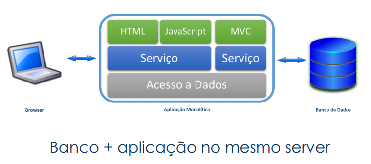

- Arquitetura **Micro serviços**

*Reparte o sistema em várias partes*

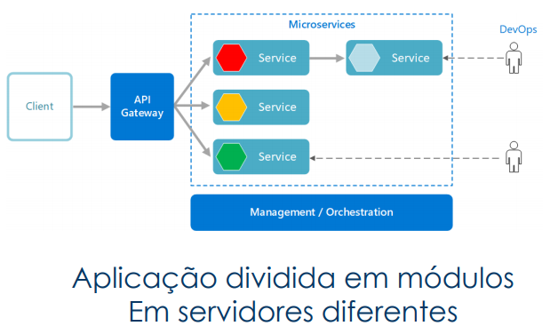

- Micro serviços: Desvantagens
  - Centralizar os log’s
  - Comunicação gerando acoplamento entre módulos

#### Parte 2: Mensageria

*Notificação de módulos ou sistemas*

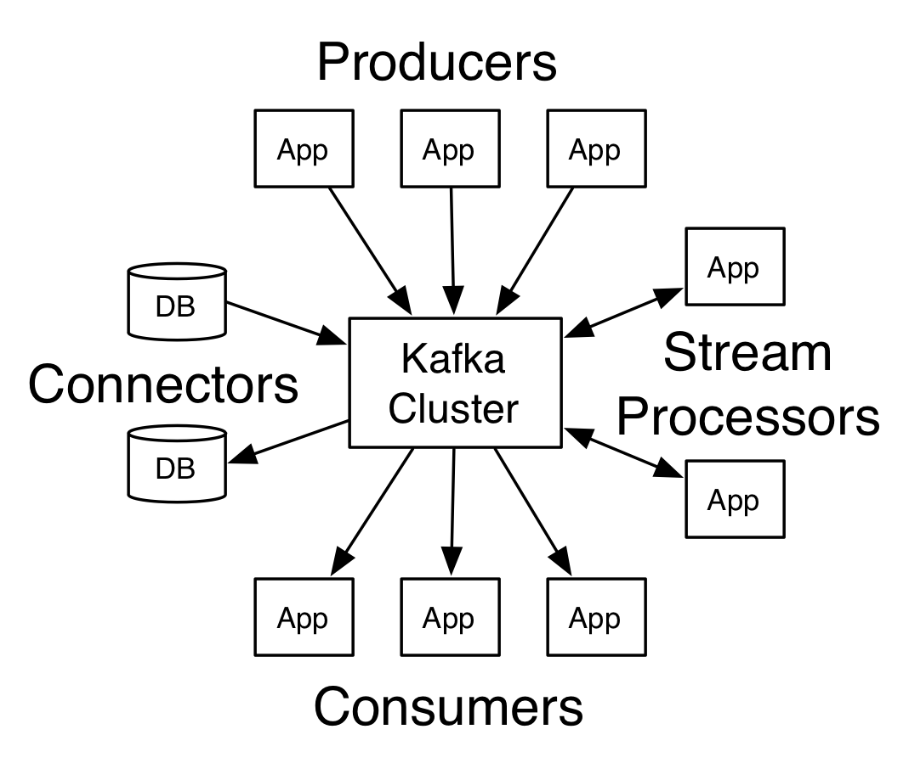

#### Parte 3: Kafka

- Open Source
- Processamento de Streams
- Não precisa Reiventar a roda

#### Parte 4: Kafka as a Service

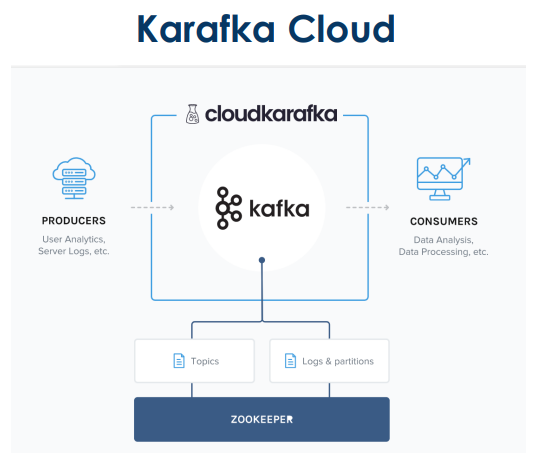


#### Parte 5: Lab - Python + Kafka

<u>Criando Cluster</u>

https://www.cloudkarafka.com/docs/api.html

Arquivos

- [Consumer.ipynb](aula26-01-2021/Consumer.ipynb)
- [Producer.ipynb](aula26-01-2021/Producer.ipynb)

```shell
!pip install confluent_kafka
```


<br>

<br>

<br>

------

## Processando grandes conjuntos de dados de forma paralela e distribuída com Spark

*Aprenda mais sobre Apache Spark, a ferramenta Big Data para o processamento de grandes conjuntos de dados mais utilizada em grandes projetos.*

:calendar: 27/01/2021		:timer_clock: 20:00h		:hourglass: 2 horas	[:arrow_up:](#aceleração-global-dev-everis-4-rocket)

<br>

<a href="/.pdfs/Live-27-01-2021-Spark.pdf" target="_blank">Slides</a>

*Notas da live*

#### Objetivos

1. Conhecendo o Spark
2. Instalação e Execução
3. SparkSQL

#### Parte 1: Conhecendo o Spark

*É um framework de Big Data. Processar grandes volumes de dados de forma intuitiva. Desenvolvido em Skala. Multilinguagem (Python, R, Java, SQL...). Pode ser utilizado sem Hadoop*

- Segundo o próprio site do Spark:
  “Apache Spark is a unified analytics engine for large-scale data processing.”

- Podemos dizer que o Spark é um framework analítico distribuído, capaz de realizar diversas operações de maneira extremamente rápida.

- Mantido pela fundação Apache (https://www.apache.org/);

- Distribuído de maneira comercial pela Databricks;

- O Spark é conhecido como um **framework in-memory**, sendo assim, **RAM** é fundamental para o bom funcionamento;

- Spark permite que utilizemos as mais diversas linguagens:

  - Scala
  - Java
  - Python
  - R
  - SQL

  **<u>Conhecendo o Spark</u>**

- Por se tratar de um framework distribuído de big data, somos capazes de trabalhar com  quantidades enormes de dados.

- A nível de comparação o Spark consegue ser até 100x mais rápido que o mapreduce tradicional:

- Em 2014, o Spark ganhou o 2014 Gray Sort Benchmark (categoria de 100TB). Em outras palavras, o Spark foi capaz de ordenar 100TB de dados em 23 minutos;

- O recorde anterior era do Hadoop Mapreduce, ordenando o mesmo arquivo em 72 minutos;

- A título de comparação, o Spark utilizou 206 máquinas (EC2 i2.8xlarge), enquanto o cluster Hadoop Mapreduce tinha 2600 nós;

- Resumindo, o Spark realizou a mesma operação 3x mais rápido e com 10x menos recursos;

- Toda operação foi feita em disco, sem fazer uso do cache em memória do Spark.

#### Arquitetura

Entendendo a arquitetura do Spark


Cluster manager - Yarn

SparkContext: Particionar em atividades menores.

Worker Node: Máquinas disponíveis para trabalhar.

Executor: Programa rodando uma JVM

Tarefas de Ordenação.

- Podemos dividir o Spark em cinco bibliotecas principais


#### RDDs

- O RDD ou Resilient Distributed Dataset é a principal abstração do Spark;
- Ele nada mais é do que uma coleção de elementos particionados entre os diversos nós de um cluster;
- RDDs contem algumas características principais:
  - Ele, como o proprio nome diz, é resiliente a falhas, ou seja, caso haja algum erro dutante o processo, ele é capaz de se recuperar e continuar a atividade;
  - RDDs são estruturados para serem naturalmente distribuídos, sendo capazes de existir entre diversos nós de um cluster;
  - Eles são imutáveis. Um RDD gera outro RDD, jamais ele poderá ser modificado. Seu conteúdo poderá ser transformado, resultando em outro RDD. ***RDD são imutáveis***
- Podemos dividir nossos processamentos em:
  - Single node: O Spark rodando em uma única máquina (1);
  - Cluster mode: O Spark distribuirá a carga entre diversas máquinas. Nesse modo dependemos de gerenciadores de recursos:
    - YARN;
    - Mesos;
    - EC2;
    - **Kubernetes**. *Versão mais recente*. Roda no Docker.

*(1) Não confunda o rodar em um único computador com a não distribuição do trabalho; o Spark ainda criará diversos executores dentro de uma mesma máquina, otimizando o processamento para a mesma (recomendo a leitura: https://databricks.com/blog/2018/05/03/benchmarking-apache-spark-on-a-single-node-machine.html);*

#### Parte 2: Instalação e execução

Para instalar o Spark:

- Baixar a versão desejada no site: http://spark.apache.org/downloads.html (trabalharemos com a
  2.4.7);
- Descompactar o arquivo (tar -zxvf spark-2.4.7-bin-hadoop2.7.tgz);
- Mover para o local desejado;

```shell
SPARK_HOME
```

`conf/` *somente para ambientes clusterizados.*

`sbin/`

`bin/`pyspark

`spark-submit`

`spark-sql`

`spark-shell`


Para instalar o Spark:

- Configurar a variável de ambiente SPARK_HOME, para a pasta onde se encontra o Spark;
- Para facilitar, configurar no PATH do sistema a pasta bin, dentro do diretório do Spark:
  - No caso do Linux, adicionar ao arquivo /etc/bash.bashrc (Debian) ou /etc/bashrc (RHEL):
    - export SPARK_HOME="/opt/spark-2.3.1-bin-hadoop2.7"
    - PATH="$PATH:$SPARK_HOME/bin"
    - export PYSPARK_PYTHON="python3"

#### Acessando o Spark

O Spark pode ser utilizado de várias maneiras:
• spark-shell;
• pyspark-shell;
• sql-shell;
• R-shell;
• Jupyter Notebooks (Python);
• Zeppelin Notebooks (Python e Scala);
• spark-submit;

##### Spark shell:

- O Spark shell é um shell interativo, no qual podemos executar rotinas de spark em scala de maneira dinâmica;
- Ele pode ser acessado utilizando o comand spark-shell, no terminal;
- Vale lembrar que o Spark shell criará automaticamente o SparkContext (sc) e o SparkSession (spark); 

- Podemos testar o spark-shell, utilizando os seguintes comandos:
  - Baixar https://raw.githubusercontent.com/fivethirtyeight/data/master/avengers/avengers.csv
  - val insurance = spark.read.format("csv").option("sep", ",").option("header",  "true").load("file:///home/everis/avengers.csv")
  - insurance.show()
  - insurance.show()
    - insurance.show(10, false)
    - insurance.select("URL")

*Spark: Leio um ou inifinitos datasets, faço transformações dos meus dados, vou criando outros dataframes. Depois, vejo o coneteúdo ou gravar o resultado.*

##### Pyspark shell

- O Pyspark shell também é um shell interativo, porém executamos rotinas de spark em python;
- Ele pode ser acessado utilizando o comando pyspark, no terminal;
- Vale lembrar que o Pyspark shell criará automaticamente o SparkContext (sc) e o SparkSession (spark); 

```shell
pyspark
```

- Podemos testar o pyspark, utilizando os seguintes comandos:
  - insurance = spark.read.format("csv").option("sep", ",").option("header", "true").load("file:///home/everis/avengers.csv")
  - insurance.show()


##### Spark SQL

- O Spark sql é outro shell interativo, no qual podemos executar rotinas de spark em SQL de maneira
  dinâmica;
- Ele pode ser acessado utilizando o comand spark-sql, no terminal; 
- Nesse shell, não utilizamos de maneira direta o Spark Context ou Spark Session.

<u>Spark shell:</u>

- Podemos testar o sql-shell, utilizando os seguintes comandos:

  ```sql
  SELECT * FROM csv.`file:///home/everis/avengers.csv`
  ```

  

##### Spark R shell

- O Spark R shell também é um shell interativo, porém executamos rotinas de spark em R;
- Ele pode ser acessado utilizando o comando sparkR, no terminal;
- O Spark R depende do R estar instalado no sistema;
- Vale lembrar que o Spark R shell criará automaticamente o SparkContext (sc) e o SparkSession (spark); 

##### Jupyter notebook

- O Jupyter notebook é um famoso ambiente interativo para desenvolvimento em python;
- Ele pode ser integrado com o Spark para executar comandos como o pyspark;
- Para instala-lo utilizar o comando pip3 install jupyter.

##### Zeppelin Notebook

- O Zeppelin notebook é um ambiente interativo semelhante ao jupyter; capaz de trabalhar com Scala, Python e Spark de maneira nativa;
- Para o funcionamento juntamente com o Spark é necessária a
  configuração da variável de ambiente SPARK_HOME

##### RDD

- O RDD ou Resilient Distributed Dataset é a principal abstração do Spark; 
- Ele nada mais é do que uma coleção de elementos particionados entre os diversos nós de um cluster;

- RDDs contém algumas características principais:
  - Ele, como o próprio nome diz, é resiliente a falhas, ou seja, caso haja algum erro durante o processo, ele é capaz de se recuperar e continuar a atividade; 
  - RDDs são estruturados para serem naturalmente distribuídos, sendo capazes de existir entre diversos nós de um cluster;
  - Eles são imutáveis. Um RDD gera outro RDD, jamais ele poderá ser modificado. Seu conteúdo poderá ser transformado, resultando em outro RDD.

##### Spark Context:

- O primeiro passo de um programa Spark é a criação de um contexto; 
- O contexto Spark é o ponto de entrada do programa. É ele o responsável por fazer a comunicação entre o programa e o ambiente;
- Quando o contexto é criado todos os objetos Spark criados ficam associados a este contexto;
- Várias propriedades do spark são configuradas diretamente no
  Spark Context;
- Criando Spark Context:
  import org.apache.spark.SparkContext
  import org.apache.spark.SparkConf
  val conf = new SparkConf().setAppName("meu aplicativo spark")
  val sc = new SparkContext(conf)

#### Parte 3: SparkSQL

##### Dataframes e Datasets

O SparkSQL consiste em um dos módulos do Spark, sendo ele uma abstração acima do core do Spark. Abaixo algumas características do módulo:

- Trabalha exclusivamente com objetos conhecidos como Dataframes e Datasets. Estes são executados acima do Spark Core (RDDs). Em outras palavras, Dataframes e Datasets nada mais são do que abstrações de tabelas dentro do Spark;
- Apesar dos Dataframes terem uma linguagem própria para manipulação dos dados, podemos trabalhar quase que exclusivamente com SQL (ANSI 2003);
- O Spark nos permite trabalhar com diversas fontes de dados (arquivos em HDFS, tabelas Hive, tabelas HBase, bancos de dados relacionais, etc.) de maneira unificada. Dessa forma, podemos cruzar diversas informações de maneira extremamente simples;

##### Spark Session

- Spark Session é o ponto central do módulo de dataframes; 

- Internamente o Spark Session tem um Spark Context associado;

- Nas versões anteriores (<2.0) tínhamos a figura do SQLContext e do HiveContext; O Spark Session unificou esses dois componentes;

- Várias configurações podem ser aplicadas ao Spark Session;

- Criando Spark Session:

  import org.apache.spark.sql.SparkSession
  val spark = SparkSession
  .builder()
  .appName("Spark SQL")
  .config("configuracao", "valor da configuracao")
  .getOrCreate()

- Em versões antigas do Spark (<2.0):

  val sparkConf = new SparkConf()
  val sc = new SparkContext(sparkConf).set("spark.some.config.option", "somevalue")
  val sqlContext = new org.apache.spark.sql.SQLContext(sc)

  

#### Documentação e outras linguagens

- Como dissemos anteriormente, um programa para Spark pode ser
  desenvolvido nas mais diversas linguagens. Caso queira maiores
  detalhes sobre cada uma das sintaxes:
- https://spark.apache.org/docs/2.4.7/
- https://spark.apache.org/docs/2.3.1/rdd-programmingguide.html
- https://spark.apache.org/docs/2.3.1/sql-programming-guide.html


##### SparkSQL

- Podemos carregar uma variedade de dados utilizando o Spark SQL:

  val dfJson = spark.read.json("file:///home/spark/Downloads/people.json")
  val dfParquet = spark.read.format("json").load("file:///home/spark/Downloads/
  people.parquet")

- Podemos carregar uma variedade de dados utilizando o Spark SQL:
  val peopleDFCsv = spark.read.format("csv").option("sep", ",").option("header",
  "true").load("file:///home/spark/Downloads/FL_insurance_sample.csv")
  val jdbcDF = spark.read
  .format("jdbc")
  .option("url", "jdbc:postgresql:dbserver")
  .option("dbtable", "schema.tablename")
  .option("user", "username")
  .option("password", "password")
  .option("driver", "com.driver.MyDriver")
  .load()

- Temos várias operações associadas aos Dataframes:
  df.printSchema()
  df.show(50,false)
  df.select("field1", "field2").show()
  df.select($"field1", $"field2"+1).show()
  df.filter($"age" > 21).show()
  df.groupBy("age").count().show()

- Temos várias operações associadas aos Dataframes:
  df.withColumn("new_column_name",
  col("old_column_name")).show()
  df.withColumn("new_column_name",
  col("old_column_name").cast("long")).show()
  df.avg("age").show()
  df.sum("sales").show()
  df.max("age").show()

  

  ##### Agora um pequeno exercício:

- Vamos baixar o arquivo https://raw.githubusercontent.com/shankarmsy/practice_Pandas/master/FL_insurance_sample.csv

- Obtenham a média do campo eq_site_limit, agrupado por construction

  ##### Solução

  import org.apache.spark.sql.SparkSession
  val spark = SparkSession.builder().appName("Spark SQL basic example").getOrCreate()

  val peopleDFCsv = spark.read.format("csv").option("sep", ",").option("header","true").load("file:///home/everis/FL_insurance_sample.csv")

  peopleDFCsv.withColumn("eq_site_limit",
  col("eq_site_limit").cast("long")).groupBy("construction",
  "county").avg("eq_site_limit").show()


##### SparkSQL

- Sim! Podemos trabalhar quase que exclusivamente com SQL, para tanto, precisamos cadastrar nosso dataframe:
  df.createTempView("people")
  df.createOrReplaceTempView("people")
  df.createGlobalTempView("people")
  df.createOrReplaceGlobalTempView("people")

- A partir daí conseguimos realizar operações de SQL:
  spark.sql("SELECT * FROM people").show()
  spark.sql("SELECT * FROM global_temp.people").show()

- Sempre que executamos uma query via sparkSQL, obtemos como retorno outro dataframe:
  val newDF = spark.sql("SELECT * FROM global_temp.people")

- A partir daí conseguimos realizar operações de SQL:
  newDF.show()

- Também podemos carregar um arquivo diretamente via SQL:
  spark.sql("SELECT * FROM
  csv.`file:///home/spark/Downloads/FL_insurance_sample.csv`").
  show()

- Outra função interessante é o create temporary view do SQL. Ele permite que criemos uma view temporária sem depender de um dataframe:

  spark.sql("CREATE TEMPORARY VIEW nova_tabela as (SELECT * FROM
  people) ")

  spark.sql("CREATE GLOBAL TEMPORARY VIEW temp_view AS (SELECT *
  FROM people) ") 

- Agora precisamos gravar nossos dados:
  val people = spark.sql("SELECT * FROM people")
  people.write.format("csv")
  .option("sep", ",")
  .option("header", "true")
  .save("file:///path/output_folder")

  people.coalesce(1).write.format("csv")
  .option("sep", ";")
  .option("header", "true")
  .save("file:///path/output_folder")

- E se quisermos os valores particionados?

  people.write.partitionBy("field_name_1", "field_name_2").format("csv")
  .option("sep", ";")
  .option("header", "true")
  .save("file:///path/output_folder")

  people.write.bucketBy(42,
  "name").sortBy("age").saveAsTable("people_bucketed")

- E para gravarmos os dados em um banco?

  people.write
  .format("jdbc")
  .option("url", "jdbc:postgresql:dbserver")
  .option("dbtable", "schema.tablename")
  .option("user", "username")
  .option("password", "password")
  .save()

- Avro depende de um pouco mais de esforço:

  import com.databricks.spark.avro._

  spark.conf.set("spark.sql.avro.compression.codec", "deflate")
  spark.conf.set("spark.sql.avro.deflate.level", "5")

  val df = spark.read.avro("/tmp/example.avro")

  df.write.avro("/tmp/output")

  ##### Save Mode

- Um ponto importante é o SaveMode:

  people.write. format("csv")
  .option("sep", ";")
  .option("header", "true")
  .mode(SaveMode.Overwrite).
  .save("file:///path/output_folder"

- Tipos de SaveMode:

  - Append
  - ErrorIfExists
  - Ignore
  - Overwrite

  ##### UDFs

- UDFs ou User Defined Functions são funções que são definidas pelo
  usuário e podem ser utilizadas para realizar transformações nos
  dados:

  spark.udf.register("minhaUDF", (s: String) => s.length())
  spark.sql("SELECT minhaUDF(field_1),* FROM table").show()

- UDAFs ou User Defined Aggregation Functions são semelhantes as
  UDFs, porém são responsáveis por realizar funções de agregação:

  - Elas são divididas em dois tipos:
    - Untyped: http://spark.apache.org/docs/latest/sqlprogramming-guide.html#untyped-user-defined-aggregatefunctions
    - Typed: http://spark.apache.org/docs/latest/sqlprogramming-guide.html#type-safe-user-defined-aggregatefunctions

- Pandas UDFs foram inseridas na versão 2.3 do Spark;

- São UDFs otimizadas para python, utilizando as capacidades do Apache Arrow;

- Elas melhoram muito a velocidade de execução de UDFs em python;

- Utilizando Pandas UDFs:

  from pyspark.sql.functions import col, pandas_udf
  from pyspark.sql.types import LongType

  def multiply_func(a, b):
  return a * b

  multiply = pandas_udf(multiply_func, returnType=LongType())

  df.select(multiply(col("x"), col("x"))).show()

- Importante!

  - UDFs, UDAFs e Pandas UDFs são naturalmente mais pesadas e impactarão na performance do seu processo;
  - Sempre que possível execute operações diretamente com comandos de Dataframe ou código SQL nativo: https://spark.apache.org/docs/2.4.7/api/sql/index.html

#### Spark e Hive

- Podemos acessar diretamente o Hive via spark:
  import java.io.File
  import org.apache.spark.sql.{Row, SaveMode, SparkSession}
  import spark.implicits._
  import spark.sql

  val warehouseLocation = new File("spark-warehouse").getAbsolutePath

  val spark = SparkSession
  .builder()
  .appName("Spark Hive")
  .config("spark.sql.warehouse.dir", warehouseLocation)
  .enableHiveSupport()
  .getOrCreate()

- Podemos acessar diretamente o Hive via spark:

  spark.sql("CREATE TABLE IF NOT EXISTS src (key INT, value STRING) USING hive")
  spark.sql("LOAD DATA LOCAL INPATH
  'examples/src/main/resources/kv1.txt' INTO TABLE src")

  spark.sql("SELECT * FROM src").show()

  val df = spark.table("src")
  df.write.mode(SaveMode.Overwrite).saveAsTable("hive_records")

#### Persist e Cache

- A seguir veremos alguns pontos importantes para melhorar a performance dos nossos programas:
  - cache e persist: Em geral o Spark pode precisar refazer uma determinada transformação várias  vezes a cada ação. Para otimizar nossos programas podemos usar o conceito de persist (ou cache), comando que armazenará os dados na memória para ser reutilizado; 
  - Pode melhorar muito a performance do seu projeto, mas deve ser usada com parcimônia,  dependendo dos recursos do cluster;
  - No próximo slide veremos os possíveis storage levels para
    persistência;

Exemplo:
val dfJson = spark.read.json("
file:///examples/src/main/resources/people.json")

dataframe.persist(StorageLevel.MEMORY_AND_DISK)
dataframe.unpersist()
dataframe.cache()

| Storage Level                                  | Meaning                                                      |
| ---------------------------------------------- | ------------------------------------------------------------ |
| MEMORY_ONLY                                    | Store RDD as deserialized Java objects in the JVM. If the RDD does not fit in memory, some partitions will not be cached and will be recomputed on the fly each time they're needed. This is the default level. |
| MEMORY_AND_DISK                                | Store RDD as deserialized Java objects in the JVM. If the RDD does not fit in memory, store the partitions that don't fit on disk, and read them from there when they're needed. |
| MEMORY_ONLY_SER<br/>(Java and Scala)           | Store RDD as serialized Java objects (one byte array per partition). This is generally more space-efficient than deserialized objects, especially when using a fast serializer, but more CPU-intensive to read. |
| MEMORY_AND_DISK_SER<br />(Java and Scala)      | Similar to MEMORY_ONLY_SER, but spill partitions that don't fit in memory to disk instead of recomputing them on the fly each time they're needed. |
| DISK_ONLY                                      | Store the RDD partitions only on disk.                       |
| MEMORY_ONLY_2,<br/>MEMORY_AND_DISK_2,<br/>etc. | Same as the levels above, but replicate each partition on two cluster nodes. |
| OFF_HEAP<br/>(experimental)                    | Similar to MEMORY_ONLY_SER, but store the data in off-heap memory. This requires off-heap memory to be enabled. |


#### Spark Submit 

- É a maneira mais comum de executarmos um sistema em Spark;
- Permite a configuração de diversos parâmetros do Spark;
- Pode trabalhar tanto com códigos python (.py, .whl, .zip) quanto com pacotes .jar (e mais recentemente .R);
- Basicamente é chamado utilizando o seguinte
  comando:
  spark-submit \
  --class <main-class> \
  --master <master-url> \
  --deploy-mode <deploy-mode> \
  --conf <key>=<value> \
  ... # other options
  <application-jar> \
  [application-arguments]


```SPARQL
# Run application locally on 8 cores
./bin/spark-submit \
--class
org.apache.spark.examples.SparkPi \
--master local[8] \
/path/to/examples.jar \
100

# Run on a Spark standalone cluster
in client deploy mode
./bin/spark-submit \
--class
org.apache.spark.examples.SparkPi \
--master spark://207.184.161.138:7077
\
--executor-memory 20G \
--total-executor-cores 100 \
/path/to/examples.jar \
1000

# Run on a Spark standalone cluster in
cluster deploy mode with supervise
./bin/spark-submit \
--class
org.apache.spark.examples.SparkPi \
--master spark://207.184.161.138:7077 \
--deploy-mode cluster \
--supervise \
--executor-memory 20G \
--total-executor-cores 100 \
/path/to/examples.jar \
1000

# Run on a YARN cluster
export HADOOP_CONF_DIR=XXX
./bin/spark-submit \
--class
org.apache.spark.examples.SparkPi \
--master yarn \
--deploy-mode cluster \ # can be
client for client mode
--executor-memory 20G \
--num-executors 50 \
/path/to/examples.jar \
1000

spark-submit \
--class=com.everis.tricorder.TricorderRun \
--properties-file spark.conf\
--files log4j.properties,[Outros arquivos] \
--conf "spark.executor.extraJavaOptions=-
Dlog4j.configuration=file://log4j.properties" \
--conf "spark.driver.extraJavaOptions=-
Dlog4j.configuration=file://log4j.properties" \
./target/app.jar \
arg01 “val_arg01" \
arg02 “val_arg02"
```

```spark
spark.app.name "tricorder"
spark.yarn.queue Desenvolvimento
spark.dynamicAllocation.enabled true
spark.dynamicAllocation.initialExecutors 1
spark.dynamicAllocation.minExecutors 5
spark.dynamicAllocation.maxExecutors 10
spark.shuffle.service.enabled true
spark.executor.cores 6
spark.driver.cores 8
spark.executor.memory 10G
```

```SPARQL
#spark.yarn.executor.memoryOverhead 1000
spark.driver.memory 20G
#spark.yarn.driver.memoryOverhead 1000
#spark.ui.port 4142
spark.ui.enabled false
spark.shuffle.compress true
spark.driver.maxResultSize 5000m
spark.default.parallelism 20000
spark.executor.heartbeatInterval 10s
spark.dynamicAllocation.sustainedSchedulerBacklogTimeout 1s
spark.dynamicAllocation.cachedExecutorIdleTimeout 120s

spark.dynamicAllocation.executorIdleTimeout 60s
spark.sql.broadcastTimeout 36000
spark.network.timeout 600s
spark.serializer org.apache.spark.serializer.KryoSerializer
spark.sql.shuffle.partitions 20000
spark.hadoop.hive.exec.dynamic.partition true
spark.hadoop.hive.exec.dynamic.partition.mode nonstrict

# Define the root logger with appender X
log4j.rootLogger = INFO,stdout
log4j.logger.com.everis = DEBUG,stdout
# Direct log messages to stdout
log4j.appender.stdout=org.apache.log4j.ConsoleAppender
log4j.appender.stdout.Target=System.out
log4j.appender.stdout.layout=org.apache.log4j.PatternLayout
log4j.appender.stdout.layout.ConversionPattern=%d{yyyy-MM-dd
HH:mm:ss} %-5p %c{1}:%L - %m%n
```

Spark submit:

- Lista com todas as configurações do spark-submit:
  - https://spark.apache.org/docs/latest/configuration.html


### Dúvidas

- Spark e  Elasticsearch

- Spark não é um BD

  

<br>

<br>

<br>

------

## Criando pipelines de dados eficientes - Parte 1

*Eleve seus conhecimentos com PySpark e processe grandes quantidades e faça um streaming em tempo real.*

:calendar: 28/01/2021		:timer_clock: 20:00h		:hourglass: 2 horas	[:arrow_up:](#aceleração-global-dev-everis-4-rocket)

<br>

<a href="/.pdfs/Live-28-01-2021-Pipelines1.pdf" target="_blank">Slides</a>

*Notas da live*


<br>

<br>

<br>

------

## Criando pipelines de dados eficientes - Parte 2

*Continue sua jornada para dominar PySpark vendo boas práticas de como ter mais domínio dos seus dados.*

:calendar: 29/01/2021		:timer_clock: 20:00h		:hourglass: 2 horas	[:arrow_up:](#aceleração-global-dev-everis-4-rocket)

<br>

<a href="/.pdfs/Live-28-01-2021-Pipelines1.pdf" target="_blank">Slides</a>

*Notas da live*


<br>

<br>

<br>

------

## Orquestrando BigData em Ambiente de Nuvem

*Aprenda como aproveitar o melhor do ambiente de nuvem para montar seu ambiente de big data de uma maneira profissional.*

:calendar: 01/02/2021		:timer_clock: 20:00h		:hourglass: 2 horas	[:arrow_up:](#aceleração-global-dev-everis-4-rocket)

<br>

<a href="/.pdfs/Live-01-02-2021-BigDataNuvem.pdf" target="_blank">Slides</a>

*Notas da live*


<br>

<br>

<br>

------

## Scala: o poder de uma linguagem multiparadigma

*Aprenda como mais sobre uma linguagem Scala, explorando seus principais tópicos e as suas vantagens de utilização em ambiente de Big Data.*

:calendar: 02/02/2021		:timer_clock: 20:00h		:hourglass: 2 horas	[:arrow_up:](#aceleração-global-dev-everis-4-rocket)

<br>

<a href="/.pdfs/Live-02-02-2021-Scala Multiparadigma.pdf" target="_blank">Slides</a>

*Notas da live*

https://mvnrepository.com


<br>

<br>

<br>

------

## O que você precisa saber para construir APIs verdadeiramente restfull

*Dicas para construir APIs do rest ao estado restfull, todas as boas práticas que soluções de microserviços de alto nível precisam ter.*

:calendar: 03/02/2021		:timer_clock: 20:00h		:hourglass: 2 horas	[:arrow_up:](#aceleração-global-dev-everis-4-rocket)

<br>

<a href="/.pdfs/Live-03-02-2021-APIsRestfull.pdf" target="_blank">Slides</a>

*Notas da live*

#### Parte 1: O que é API

- Application Program Interface
- Pense em API como a camada que esconde as regras e possibilita uma comunicação externa
- Facilita muito a integração
- Existem várias metodologias ( ou arquiteturas ), como por exemplo: SOA, Rest, uso por meio de SDK

#### Parte 2: Rest / Restful

**Rest:** Metodologia / Arquitetura

**Restful:** API que faz uso do Rest

*Características*

- Trafego dos dados por JSON ( os antigos ainda usam xml )

- Padronização de endpoint’s

- Uso de HTTP Methods ( Get, Post, Put, Delete )

- Fácil entendimento ao iniciar uma integração

##### Http Methods

- Get: Sempre obtém os dados

- Post: Cria um novo registro ou Recurso

- Put: Atualiza um registro existente

- Delete: Remove um registro existente

##### Padrões

- Get: /api/dev/user
- Post: /api/dev/user 
- Put: /api/dev/user/{id}
- Delete: /api/dev/user/{id}

##### Erros comuns

- Post: /api/dev/user/{id}
- Post: /api/dev/user/create
- Put: /api/dev/user
- Delete: /api/dev/user?id=2

##### Status Codes

Geralmente:

- 2x…. = Sucesso
- 4x…. = Erro no cliente
- 5x…. = Erro server side

*Status comuns:*

- 200 = OK
- 401 = Unauthorized
- 403 = Forbidden
- 404 = Not found
- 500 = Internal Server Error
- 504 = Gateway Timeout

Referência
www.httpstatuses.com

#### Postman

Abrir o arquivo [Aceleracao Everis - Postman.postman_collection.json](/live03-02-2021/Aceleracao%20Everis%20-%20Postman.postman_collection.json)

<br>

<br>

<br>

------

## Graduação - habilidades que diferenciam um sênior na everis

*ACELERAÇÃO GLOBAL EVERIS*

:calendar: 04/02/2021		:timer_clock: 20:00h		:hourglass: 2 horas	[:arrow_up:](#aceleração-global-dev-everis-4-rocket)

<br>

*Notas da live*

- Profissional Sênior
  - Compartilhar informações
  - Relacionamento e Gestão de Pessoas
  - Busca por Conhecimento
  - Saber buscar a resposta
  - Aprender rápido
  - Ambiente Remoto até Junho no mínimo
  - Escritório Central em São Paulo

Metodologia Ágil: As metodologias Kanban são contínuas e mais fluidas, enquanto o Scrum é baseado em sprints de trabalho curtos e estruturados

Ferramentas mais utilizadas no momento: Cloud Azure, Cloud Google, Cloud Amazon. Preferencialmente da Microsoft.

Programa de Aceleração

​	Transição de carreira

Entrevistas podem ocorrer a partir da próxima semana 07/02

Trabalho CLT


